## ENCODE Data

The [ENCODE Project](https://www.encodeproject.org/) generated a wealth of data 
[and publications](https://www.encodeproject.org/publications/) on DNA and RNA 
regulatory elements. All this data is 
[freely accesible in their web](https://www.encodeproject.org/matrix/?type=Experiment&status=released)
and most of it also via other sources.

In this example we'll use ENCODE data downloaded from the UCSC at
[http://http://hgdownload.soe.ucsc.edu/goldenPath/hg19/encodeDCC/] to study the
chromatin conformation of a small genomic region in the K562 cell line.

We'll plot the TP53 region and our plot will contain: the genes in the region, 
the chromatin state as defined by a hidden markov model (HMM) and the peak
profiles for a number of histone modifications and a few DNA-binding elements.

## Let's start

We'll start by defining the region we want to plot and 
creating a basic karyoplot of that region.


```r
TP53.region <- toGRanges("chr17:7,564,422-7,602,719")

kp <- plotKaryotype(zoom = TP53.region)
```

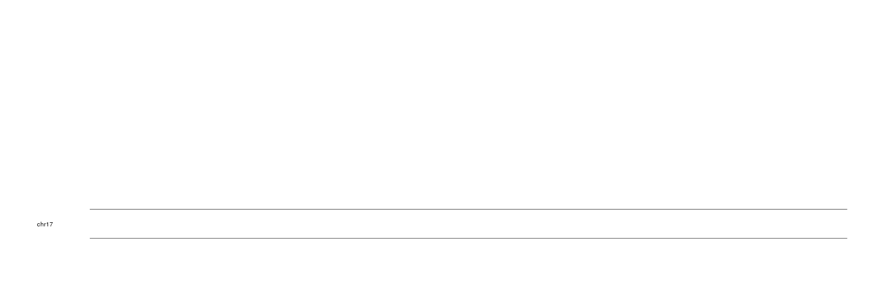

And we'll start by plotting the genes in this region using `kpPlotGenes`. 
We'll first load the 
[TxDb.Hsapiens.UCSC.hg19.knownGene](https://bioconductor.org/packages/release/data/annotation/html/TxDb.Hsapiens.UCSC.hg19.knownGene.html), and create a `gene.data` structure with it
so `kpPlotGenes` can work.


```r
library(TxDb.Hsapiens.UCSC.hg19.knownGene)

genes.data <- makeGenesDataFromTxDb(TxDb.Hsapiens.UCSC.hg19.knownGene,
                                    karyoplot=kp,
                                    plot.transcripts = TRUE, 
                                    plot.transcripts.structure = TRUE)

kp <- plotKaryotype(zoom = TP53.region)
kpPlotGenes(kp, data=genes.data)
```

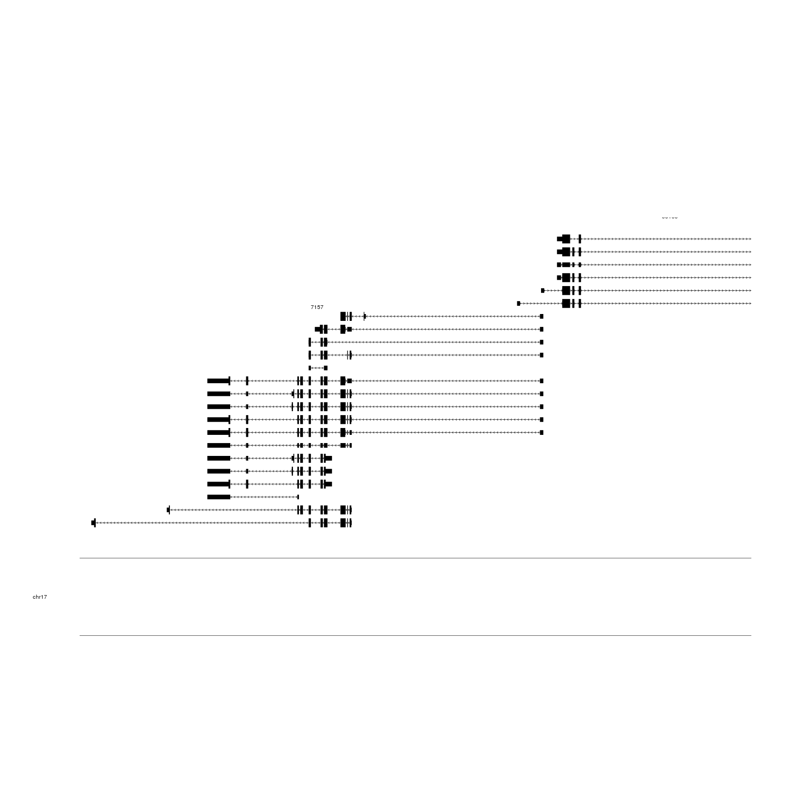

We can see all different transcripts for the genes in this region and a number
istead of a gene symbol. We'll use `mergeTranscripts` to merge all trascripts 
of each gene into one and `addGeneNames` to transform the identifiers into
standard gene symbols using the data in [`org.Hs.eg.db`](	http://bioconductor.org/packages/org.Hs.eg.db/). Since we have created the 
`genes.data` automatically, `addGeneNames` will recognize and load the required
orgDB object automatically. We'll also use `cex` to increase the size of the 
chromosome name.


```r
genes.data <- addGeneNames(genes.data)
genes.data <- mergeTranscripts(genes.data)

kp <- plotKaryotype(zoom = TP53.region, cex=2)
kpPlotGenes(kp, data=genes.data)
```

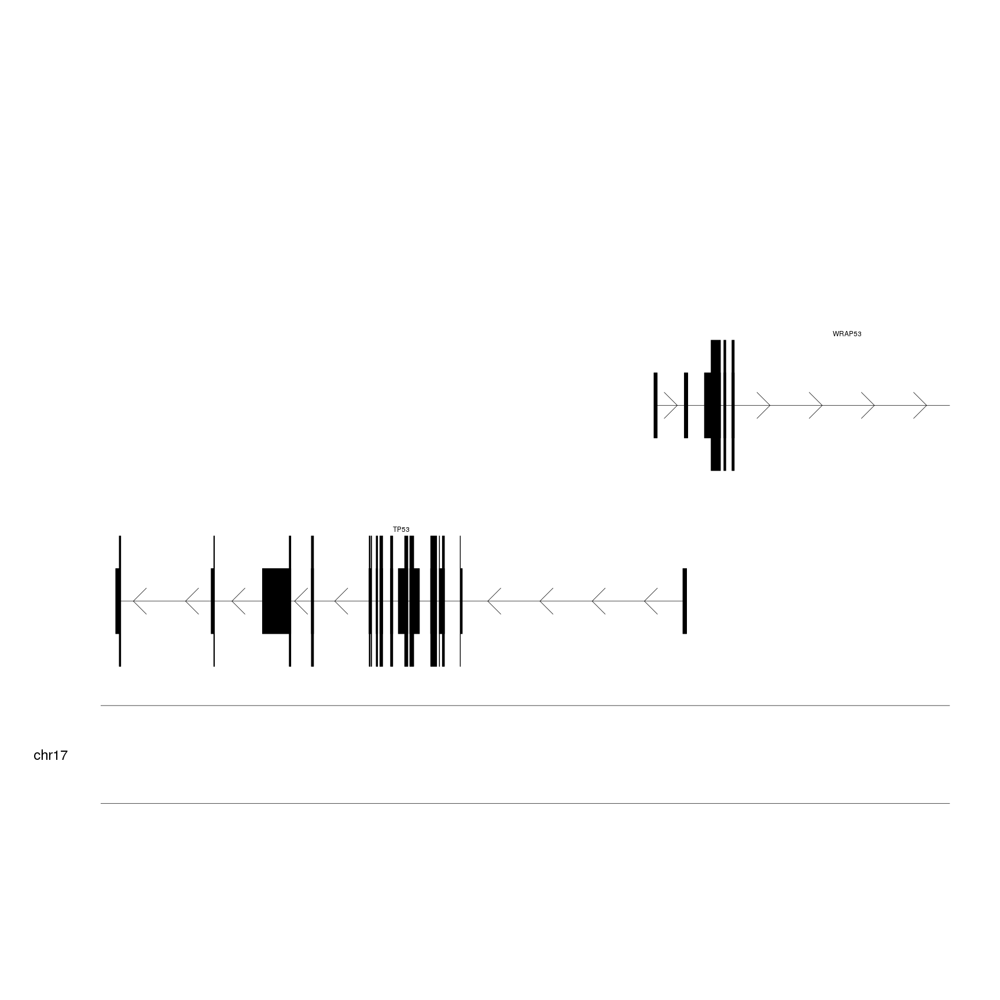

Ok, now we have a more suitable representation of the genes for our purpose.

The next step will be use 
[r0 and r1]({{ site.baseurl }}))
to plot the genes at the bottom of the plotting area to leave space for the
other data elements. We'll also increase the font text size using 
`gene.name.cex`. 


```r
kp <- plotKaryotype(zoom = TP53.region, cex=2)
kpPlotGenes(kp, data=genes.data, r0=0, r1=0.15, gene.name.cex = 2)
```

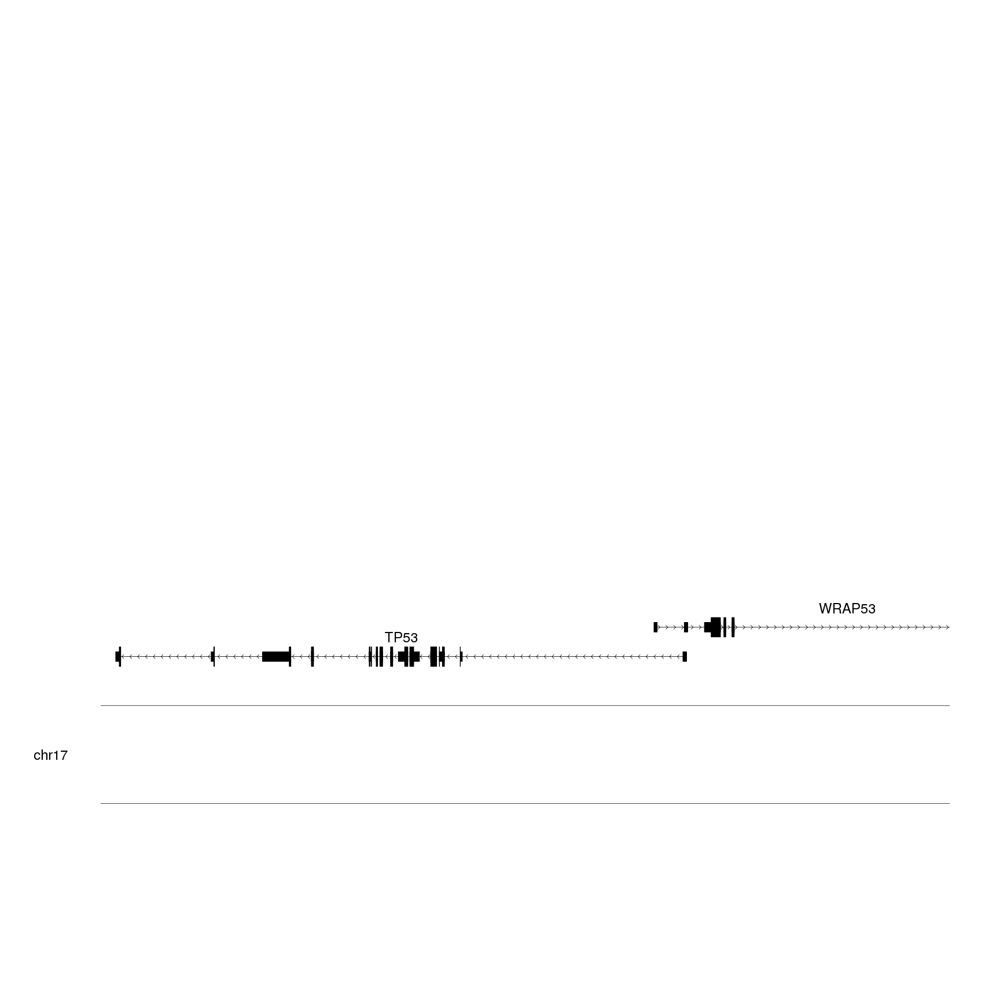

In our next step, we'll load the genome state HMM results. We will first use
[BiocFileCache](http://bioconductor.org/packages/BiocFileCache/) to download 
the data file and make it persistent between sessions. This means that we'll 
download the file once to our disk and it will be there for us next time. 

To load the data into R we'll use `toGRanges` from package
[regioneR](http://bioconductor.org/packages/regioneR/).


```r
library(BiocFileCache)
bfc <- BiocFileCache(ask=FALSE)
K562.hmm.file <- bfcrpath(bfc, "http://hgdownload.soe.ucsc.edu/goldenPath/hg19/encodeDCC/wgEncodeBroadHmm/wgEncodeBroadHmmK562HMM.bed.gz")
K562.hmm <- toGRanges(K562.hmm.file)
K562.hmm
```

```
## GRanges object with 622257 ranges and 4 metadata columns:
##            seqnames              ranges strand |              name
##               <Rle>           <IRanges>  <Rle> |       <character>
##        [1]     chr1         10001-10600      * | 15_Repetitive/CNV
##        [2]     chr1         10601-10937      * | 13_Heterochrom/lo
##        [3]     chr1         10938-11937      * |       8_Insulator
##        [4]     chr1         11938-12337      * | 5_Strong_Enhancer
##        [5]     chr1         12338-13137      * |   7_Weak_Enhancer
##        ...      ...                 ...    ... .               ...
##   [622253]     chrX 155256807-155257806      * |       11_Weak_Txn
##   [622254]     chrX 155257807-155259206      * |       8_Insulator
##   [622255]     chrX 155259207-155259406      * |   6_Weak_Enhancer
##   [622256]     chrX 155259407-155259606      * |   7_Weak_Enhancer
##   [622257]     chrX 155259607-155260406      * | 15_Repetitive/CNV
##                score     itemRgb               thick
##            <numeric> <character>           <IRanges>
##        [1]         0     #F5F5F5         10001-10600
##        [2]         0     #F5F5F5         10601-10937
##        [3]         0     #0ABEFE         10938-11937
##        [4]         0     #FACA00         11938-12337
##        [5]         0     #FFFC04         12338-13137
##        ...       ...         ...                 ...
##   [622253]         0     #99FF66 155256807-155257806
##   [622254]         0     #0ABEFE 155257807-155259206
##   [622255]         0     #FFFC04 155259207-155259406
##   [622256]         0     #FFFC04 155259407-155259606
##   [622257]         0     #F5F5F5 155259607-155260406
##   -------
##   seqinfo: 23 sequences from an unspecified genome; no seqlengths
```

We can see that for each region we have a name and a color. We'll use the
color column to set the colors of the regions when calling 
[`kpPlotRegions`]({{ site.baseurl }})).


```r
kp <- plotKaryotype(zoom = TP53.region, cex=2)
kpPlotGenes(kp, data=genes.data, r0=0, r1=0.15, gene.name.cex = 2)
kpPlotRegions(kp, K562.hmm, col=K562.hmm$itemRgb, r0=0.22, r1=0.3)
```

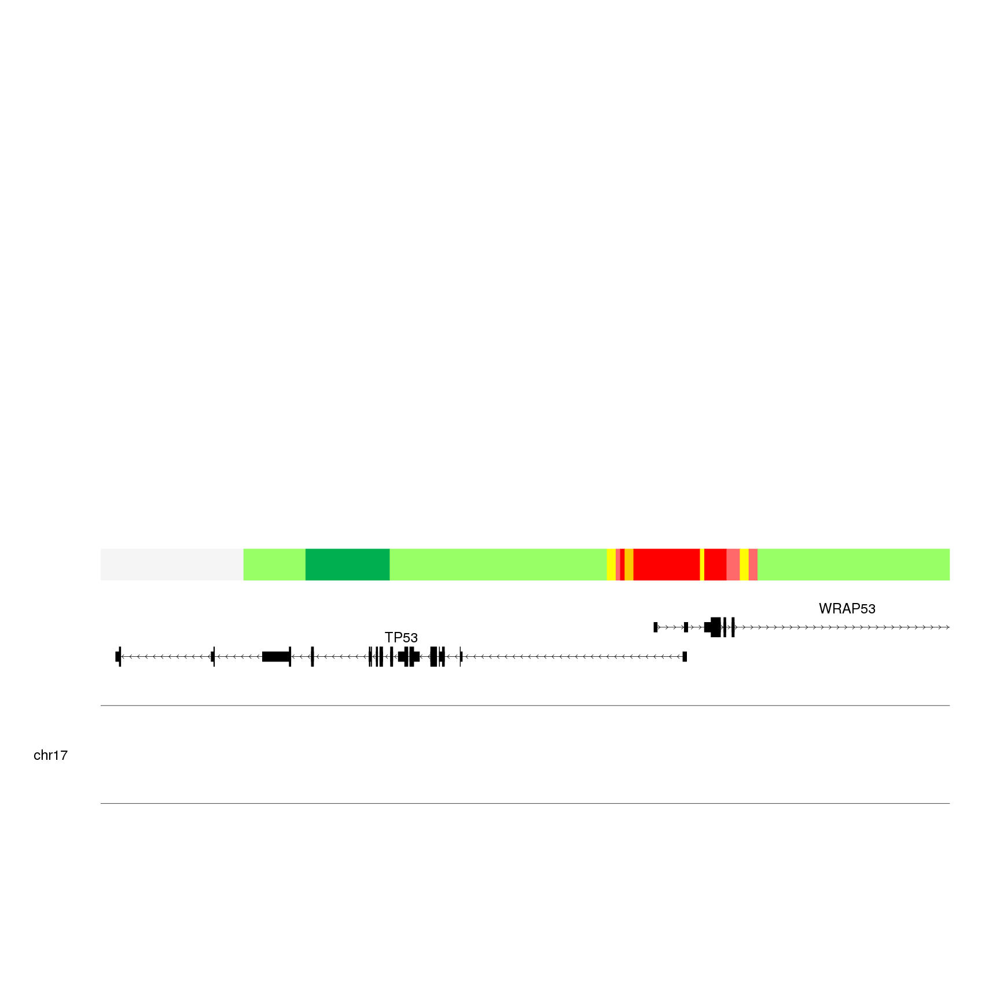
We can see that we have the most interesting part in the region where
the two genes overlap. To start identifying the elements in the plot we'll use 
[`kpAddLabels`]({{ site.baseurl }})).


```r
kp <- plotKaryotype(zoom = TP53.region, cex=2)
kpPlotGenes(kp, data=genes.data, r0=0, r1=0.15, gene.name.cex = 2)
kpPlotRegions(kp, K562.hmm, col=K562.hmm$itemRgb, r0=0.22, r1=0.3)
kpAddLabels(kp, labels = "Chromatin\nState (HMM)", r0=0.22, r1=0.3, cex=2)
```

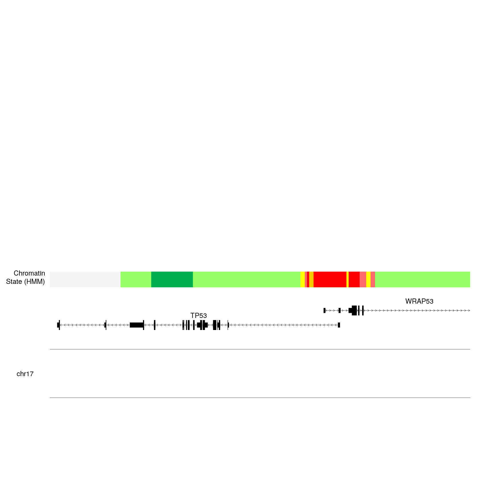

Now that we have the context, we can start adding the epigenetic data. In 
this case we'll plot data contained in 
[BigWig files](http://genome.ucsc.edu/goldenPath/help/bigWig.html) using 
`kpPlotBigWig`. Internally, `kpPlotBigWig` uses 
[rtracklayer](http://bioconductor.org/packages/rtracklayer/)'s
[BigWigFile](https://rdrr.io/bioc/rtracklayer/man/BigWigFile.html) to import 
BigWig data. This allows it to take advantage of the BigWig index and remote
loading: we can plot bigwig files either in our own computer or in external 
servers (as we will see now) and in any case, only the data required to 
our plot will be loaded. In this example we'll use the ENCODE data passing 
the remote file URL to `kpPlotBigWig` and the function will only download 
the data overlapping the visible part of the genome.

**IMPORTANT!** Due to restrictions in `rtracklayer` bigwig management, 
`kpPlotBigWig` **does not work on Windows**. It only works on Linux and Mac
computers.

As a first example, we'll plot the trimethylation levels of the lysine 4 of the
histone 3 (H3K4me3). And we will plot it bewteen 0.35 and 1.


```r
kp <- plotKaryotype(zoom = TP53.region, cex=2)
kpPlotGenes(kp, data=genes.data, r0=0, r1=0.15, gene.name.cex = 2)
kpPlotRegions(kp, K562.hmm, col=K562.hmm$itemRgb, r0=0.22, r1=0.3)
kpAddLabels(kp, labels = "Chromatin\nState (HMM)", r0=0.22, r1=0.3, cex=2)

bigwig.file <- "http://hgdownload.soe.ucsc.edu/goldenPath/hg19/encodeDCC/wgEncodeBroadHistone/wgEncodeBroadHistoneK562H3k4me3StdSig.bigWig"

kpPlotBigWig(kp, data=bigwig.file, r0=0.35, r1=1)
```


We can see a new gray line with a tiny wiggle in the red region. This is not 
very informative. The problem we are seeing is that the default `ymax` value 
is set to "global", that is, ymax will be automatically set to the height of the 
tallest peak in the genome, which is much higher than the signal we see in our 
region. If we set `ymax="visible.region"`, ymax will be adjusted to the height 
of the peaks in the visible region, producing a much nicer plot (and usually 
more informative).


```r
kp <- plotKaryotype(zoom = TP53.region, cex=2)
kpPlotGenes(kp, data=genes.data, r0=0, r1=0.15, gene.name.cex = 2)
kpPlotRegions(kp, K562.hmm, col=K562.hmm$itemRgb, r0=0.22, r1=0.3)
kpAddLabels(kp, labels = "Chromatin\nState (HMM)", r0=0.22, r1=0.3, cex=2)

bigwig.file <- "http://hgdownload.soe.ucsc.edu/goldenPath/hg19/encodeDCC/wgEncodeBroadHistone/wgEncodeBroadHistoneK562H3k4me3StdSig.bigWig"

kpPlotBigWig(kp, data=bigwig.file, ymax="visible.region", r0=0.35, r1=1)
```

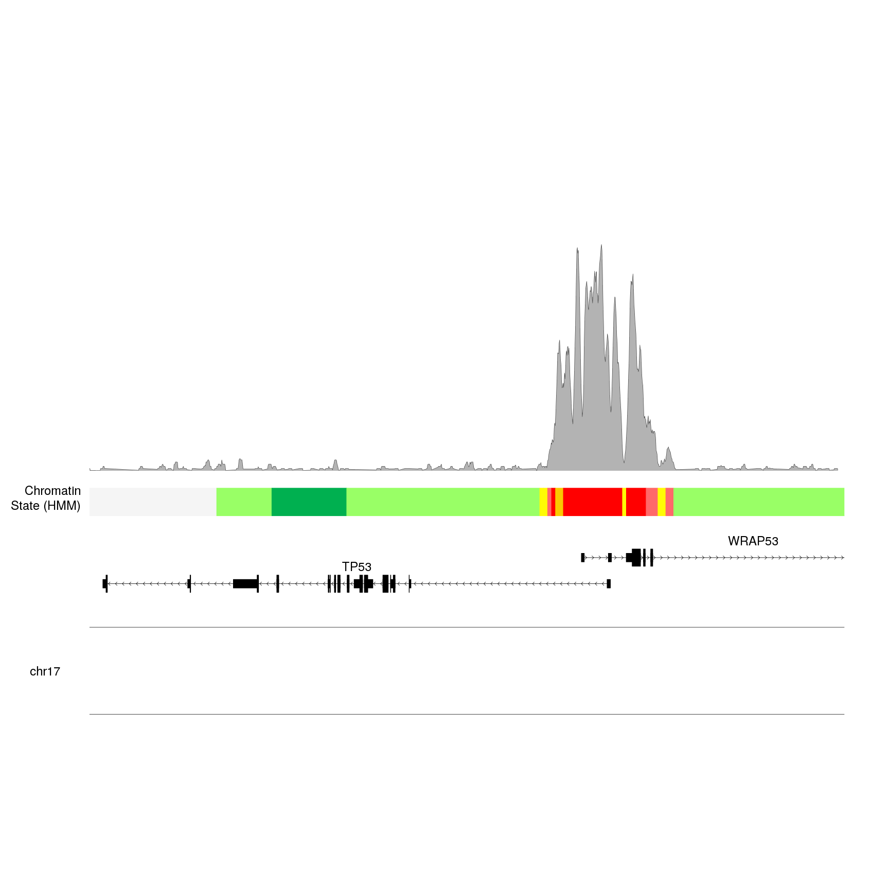

To produce this plot, `kpPlotBigWig` connected to the UCSC servers, extracted 
the data in the bigwig file overlapping the visible region, computed the maximum
value to set `ymax` and plotted the data.

We can now add other histone modifications to the plot, for example, histone 3
lysine 36 trimethylation (H3K36me3). For that well have to adjust the r0 and r1 
specifications.


```r
kp <- plotKaryotype(zoom = TP53.region, cex=2)
kpPlotGenes(kp, data=genes.data, r0=0, r1=0.15, gene.name.cex = 2)
kpPlotRegions(kp, K562.hmm, col=K562.hmm$itemRgb, r0=0.22, r1=0.3)
kpAddLabels(kp, labels = "Chromatin\nState (HMM)", r0=0.22, r1=0.3, cex=2)

H3K4me3.bw <- "http://hgdownload.soe.ucsc.edu/goldenPath/hg19/encodeDCC/wgEncodeBroadHistone/wgEncodeBroadHistoneK562H3k4me3StdSig.bigWig"
kp <- kpPlotBigWig(kp, data=H3K4me3.bw, ymax="visible.region", r0=0.35, r1=0.65)

H3K36me3.bw <- "http://hgdownload.soe.ucsc.edu/goldenPath/hg19/encodeDCC/wgEncodeBroadHistone/wgEncodeBroadHistoneK562H3k36me3StdSig.bigWig"
kpPlotBigWig(kp, data=H3K36me3.bw, ymax="visible.region", r0=0.7, r1=1)
```

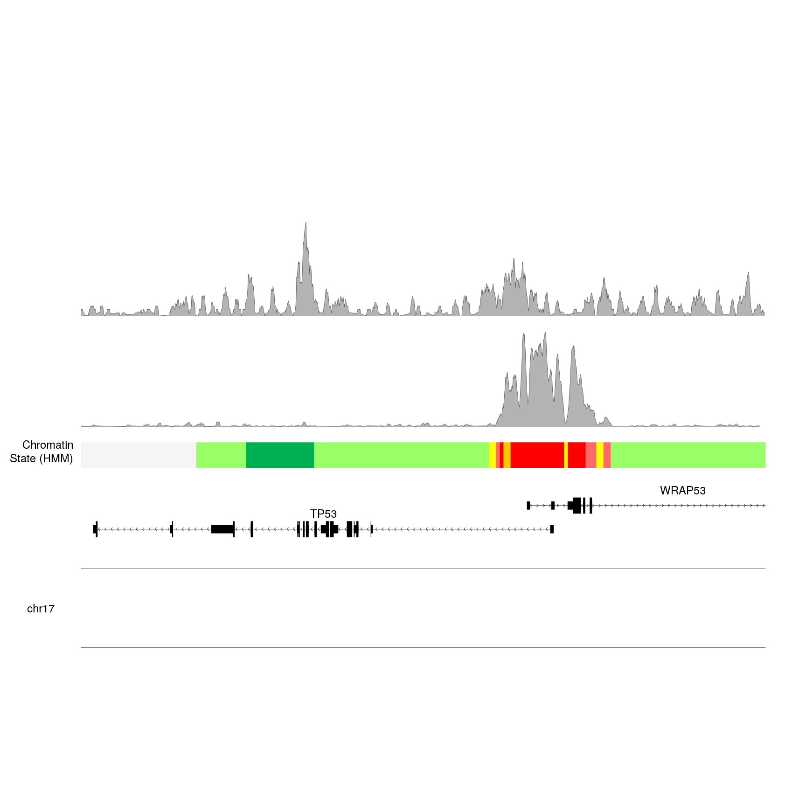

And we can see a pretty different peak profile. However, we are missing 
some information here: are these peaks comparable? What is the relative height 
of each one? To help us interpret what we see we can add y axis. 

To automatically adjust the axis we will take advantage of the fact that 
`kpPlotBigWig` returns the original karyoplot object with the computed value 
for `ymax` attached. We have to assign the result of `kpPlotBigWig` to `kp` and
access the values at `kp$latest.plot$computed.values`.

We wil also add a label to identify each chromatin mark. 


```r
kp <- plotKaryotype(zoom = TP53.region, cex=2)
kpPlotGenes(kp, data=genes.data, r0=0, r1=0.15, gene.name.cex = 2)
kpPlotRegions(kp, K562.hmm, col=K562.hmm$itemRgb, r0=0.22, r1=0.3)
kpAddLabels(kp, labels = "Chromatin\nState (HMM)", r0=0.22, r1=0.3, cex=2)

H3K4me3.bw <- "http://hgdownload.soe.ucsc.edu/goldenPath/hg19/encodeDCC/wgEncodeBroadHistone/wgEncodeBroadHistoneK562H3k4me3StdSig.bigWig"
kp <- kpPlotBigWig(kp, data=H3K4me3.bw, ymax="visible.region", r0=0.35, r1=0.65)
computed.ymax <- kp$latest.plot$computed.values$ymax
kpAxis(kp, ymin=0, ymax=computed.ymax, r0=0.35, r1=0.65)
kpAddLabels(kp, labels = "H3K4me3", r0=0.35, r1=0.65, cex=1.6, label.margin = 0.035)

H3K36me3.bw <- "http://hgdownload.soe.ucsc.edu/goldenPath/hg19/encodeDCC/wgEncodeBroadHistone/wgEncodeBroadHistoneK562H3k36me3StdSig.bigWig"
kp <- kpPlotBigWig(kp, data=H3k36me3.bw, ymax="visible.region", r0=0.7, r1=1)
computed.ymax <- kp$latest.plot$computed.values$ymax
kpAxis(kp, ymin=0, ymax=computed.ymax, r0=0.7, r1=1)
kpAddLabels(kp, labels = "H3K36me3", r0=0.7, r1=1, cex=1.6, label.margin = 0.035)
```

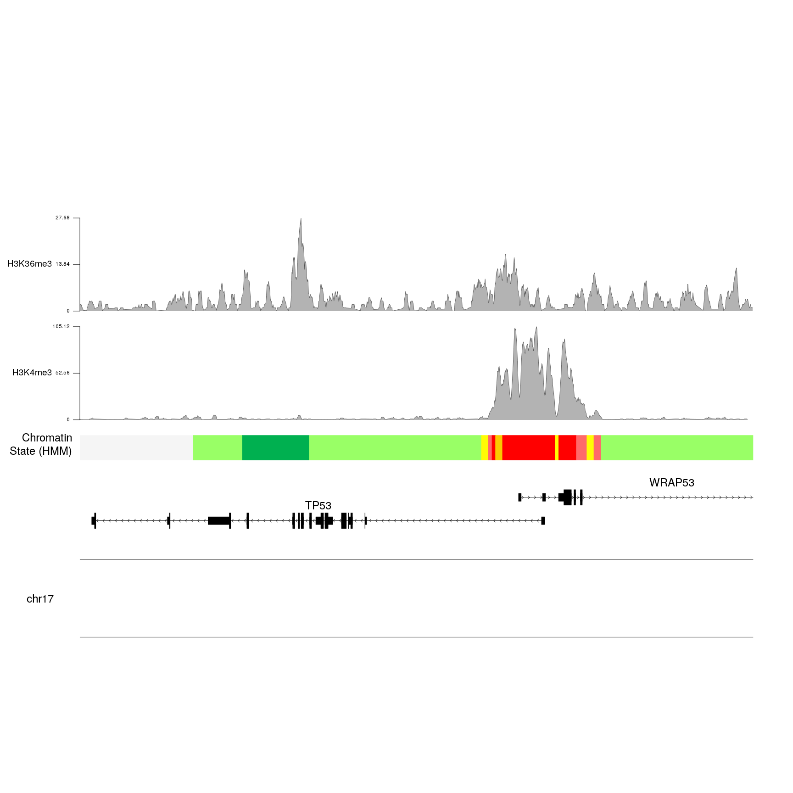

And we can see that the values for H3K4me3 are about four times higher than 
the ones for H3K36me3. 

What we can also see is that we have started repeating code and that it
would be better to use a loop for that. We will use the 
`autotrack` function to automatically get the `r0` and `r1` values.

In addition, we will improve the axis definition with a `ceiling` call.


```r
histone.marks <- c(H3K4me3="wgEncodeBroadHistoneK562H3k4me3StdSig.bigWig",
                   H3K36me3="wgEncodeBroadHistoneK562H3k36me3StdSig.bigWig")

base.url <- "http://hgdownload.soe.ucsc.edu/goldenPath/hg19/encodeDCC/wgEncodeBroadHistone/"

kp <- plotKaryotype(zoom = TP53.region, cex=2)
kpPlotGenes(kp, data=genes.data, r0=0, r1=0.15, gene.name.cex = 2)
kpPlotRegions(kp, K562.hmm, col=K562.hmm$itemRgb, r0=0.22, r1=0.3)
kpAddLabels(kp, labels = "Chromatin\nState (HMM)", r0=0.22, r1=0.3, cex=2)

for(i in seq_len(length(histone.marks))) {
  bigwig.file <- paste0(base.url, histone.marks[i])
  at <- autotrack(i, length(histone.marks), r0=0.35, r1=1)
  kp <- kpPlotBigWig(kp, data=bigwig.file, ymax="visible.region", 
                     r0=at$r0, r1=at$r1)
  computed.ymax <- ceiling(kp$latest.plot$computed.values$ymax)
  kpAxis(kp, ymin=0, ymax=computed.ymax, numticks = 2, r0=at$r0, r1=at$r1)
  kpAddLabels(kp, labels = names(histone.marks)[i], r0=at$r0, r1=at$r1, 
              cex=1.6, label.margin = 0.035)
}
```


Once we have the for loop and the `autotrack` in place, we can increase the 
number of histone marks and everything will autoadjust.


```r
histone.marks <- c(H3K4me3="wgEncodeBroadHistoneK562H3k4me3StdSig.bigWig",
                   H3K36me3="wgEncodeBroadHistoneK562H3k36me3StdSig.bigWig",
                   H3K27ac="wgEncodeBroadHistoneK562H3k27acStdSig.bigWig",
                   H3K9ac="wgEncodeBroadHistoneK562H3k9acStdSig.bigWig",
                   H3K27me3="wgEncodeBroadHistoneK562H3k27me3StdSig.bigWig")

base.url <- "http://hgdownload.soe.ucsc.edu/goldenPath/hg19/encodeDCC/wgEncodeBroadHistone/"

kp <- plotKaryotype(zoom = TP53.region, cex=2)
kpPlotGenes(kp, data=genes.data, r0=0, r1=0.15, gene.name.cex = 2)
kpPlotRegions(kp, K562.hmm, col=K562.hmm$itemRgb, r0=0.22, r1=0.3)
kpAddLabels(kp, labels = "Chromatin\nState (HMM)", r0=0.22, r1=0.3, cex=2)

for(i in seq_len(length(histone.marks))) {
  bigwig.file <- paste0(base.url, histone.marks[i])
  at <- autotrack(i, length(histone.marks), r0=0.35, r1=1, margin = 0.1)
  kp <- kpPlotBigWig(kp, data=bigwig.file, ymax="visible.region", 
                     r0=at$r0, r1=at$r1)
  computed.ymax <- ceiling(kp$latest.plot$computed.values$ymax)
  kpAxis(kp, ymin=0, ymax=computed.ymax, numticks = 2, r0=at$r0, r1=at$r1)
  kpAddLabels(kp, labels = names(histone.marks)[i], r0=at$r0, r1=at$r1, 
              cex=1.6, label.margin = 0.035)
}
```

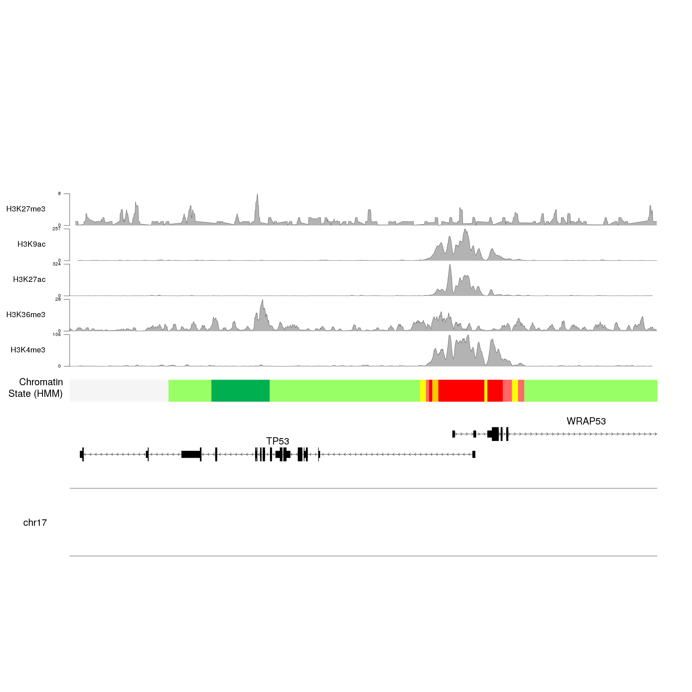

We can now adjust the 
[plotting parameters]({{ site.baseurl }}))
to reduce the margins and the 
ideogram height and change the colors to improve the general appearance of
the plot.


```r
pp <- getDefaultPlotParams(plot.type=1)
pp$leftmargin <- 0.15
pp$topmargin <- 15
pp$bottommargin <- 15
pp$ideogramheight <- 5
pp$data1inmargin <- 10

kp <- plotKaryotype(zoom = TP53.region, cex=2, plot.params = pp)
kpAddBaseNumbers(kp, tick.dist = 10000, minor.tick.dist = 2000,
                 add.units = TRUE, cex=1.3, digits = 6)
kpPlotGenes(kp, data=genes.data, r0=0, r1=0.1, gene.name.cex = 2)
kpPlotRegions(kp, K562.hmm, col=K562.hmm$itemRgb, r0=0.15, r1=0.18)
kpAddLabels(kp, labels = "Chromatin\nState (HMM)", r0=0.15, r1=0.18, cex=2)

for(i in seq_len(length(histone.marks))) {
  bigwig.file <- paste0(base.url, histone.marks[i])
  at <- autotrack(i, length(histone.marks), r0=0.23, r1=1, margin = 0.1)
  kp <- kpPlotBigWig(kp, data=bigwig.file, ymax="visible.region",
                     r0=at$r0, r1=at$r1, col = "cadetblue2")
  computed.ymax <- ceiling(kp$latest.plot$computed.values$ymax)
  kpAxis(kp, ymin=0, ymax=computed.ymax, numticks = 2, r0=at$r0, r1=at$r1)
  kpAddLabels(kp, labels = names(histone.marks)[i], r0=at$r0, r1=at$r1, 
              cex=1.6, label.margin = 0.035)
}
```

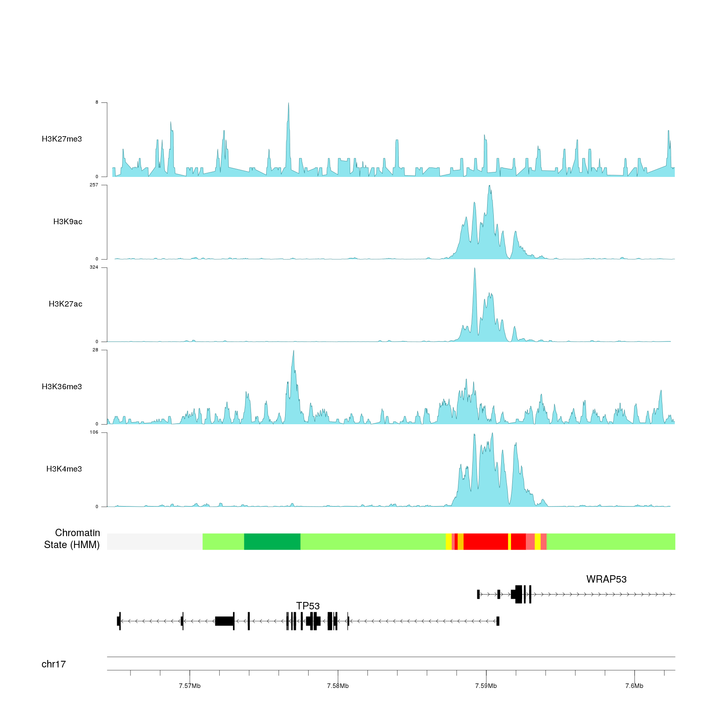

And we can even add other experimental peaks and use nested `autotrack`s to
position them all.


```r
base.url <- "http://hgdownload.soe.ucsc.edu/goldenPath/hg19/encodeDCC/wgEncodeBroadHistone/"
histone.marks <- c(H3K4me3="wgEncodeBroadHistoneK562H3k4me3StdSig.bigWig",
                   H3K36me3="wgEncodeBroadHistoneK562H3k36me3StdSig.bigWig",
                   H3K27ac="wgEncodeBroadHistoneK562H3k27acStdSig.bigWig",
                   H3K9ac="wgEncodeBroadHistoneK562H3k9acStdSig.bigWig",
                   H3K27me3="wgEncodeBroadHistoneK562H3k27me3StdSig.bigWig")

DNA.binding <- c(CTCF="wgEncodeBroadHistoneK562CtcfStdSig.bigWig",
                 EZH2="wgEncodeBroadHistoneK562Ezh239875StdSig.bigWig",
                 POL2="wgEncodeBroadHistoneK562Pol2bStdSig.bigWig",
                 P300="wgEncodeBroadHistoneK562P300StdSig.bigWig",
                 HDAC1="wgEncodeBroadHistoneK562Hdac1sc6298StdSig.bigWig",
                 HDAC2="wgEncodeBroadHistoneK562Hdac2a300705aStdSig.bigWig")


pp <- getDefaultPlotParams(plot.type=1)
pp$leftmargin <- 0.15
pp$topmargin <- 15
pp$bottommargin <- 15
pp$ideogramheight <- 5
pp$data1inmargin <- 10

kp <- plotKaryotype(zoom = TP53.region, cex=2, plot.params = pp)
kpAddBaseNumbers(kp, tick.dist = 10000, minor.tick.dist = 2000,
                 add.units = TRUE, cex=1.3, digits = 6)
kpPlotGenes(kp, data=genes.data, r0=0, r1=0.1, gene.name.cex = 2)
kpPlotRegions(kp, K562.hmm, col=K562.hmm$itemRgb, r0=0.15, r1=0.18)
kpAddLabels(kp, labels = "Chromatin\nState (HMM)", r0=0.15, r1=0.18, cex=2)

#Histone marks
total.tracks <- length(histone.marks)+length(DNA.binding)
out.at <- autotrack(1:length(histone.marks), total.tracks, margin = 0.3, r0=0.23)

for(i in seq_len(length(histone.marks))) {
  bigwig.file <- paste0(base.url, histone.marks[i])
  at <- autotrack(i, length(histone.marks), r0=out.at$r0, r1=out.at$r1, margin = 0.1)
  kp <- kpPlotBigWig(kp, data=bigwig.file, ymax="visible.region",
                     r0=at$r0, r1=at$r1, col = "cadetblue2")
  computed.ymax <- ceiling(kp$latest.plot$computed.values$ymax)
  kpAxis(kp, ymin=0, ymax=computed.ymax, numticks = 2, r0=at$r0, r1=at$r1)
  kpAddLabels(kp, labels = names(histone.marks)[i], r0=at$r0, r1=at$r1, 
              cex=1.6, label.margin = 0.035)
}

#DNA binding proteins
out.at <- autotrack((length(histone.marks)+1):total.tracks, total.tracks, margin = 0.3, r0=0.23)

for(i in seq_len(length(DNA.binding))) {
  bigwig.file <- paste0(base.url, DNA.binding[i])
  at <- autotrack(i, length(DNA.binding), r0=out.at$r0, r1=out.at$r1, margin = 0.1)
  kp <- kpPlotBigWig(kp, data=bigwig.file, ymax="visible.region",
                     r0=at$r0, r1=at$r1, col = "darkolivegreen1")
  computed.ymax <- ceiling(kp$latest.plot$computed.values$ymax)
  kpAxis(kp, ymin=0, ymax=computed.ymax, numticks = 2, r0=at$r0, r1=at$r1)
  kpAddLabels(kp, labels = names(DNA.binding)[i], r0=at$r0, r1=at$r1, 
              cex=1.6, label.margin = 0.035)
}
```

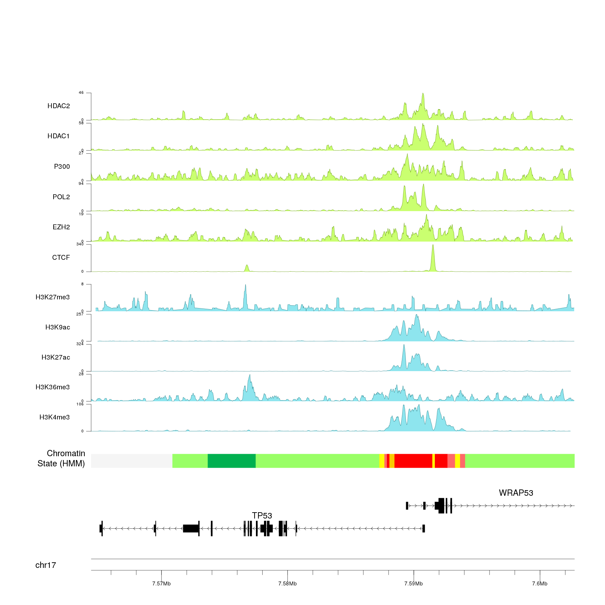

And add a main title, a couple of additional labels and adjust a few parameters
(text sizes, etc...) to get a better final image.


```r
base.url <- "http://hgdownload.soe.ucsc.edu/goldenPath/hg19/encodeDCC/wgEncodeBroadHistone/"
histone.marks <- c(H3K4me3="wgEncodeBroadHistoneK562H3k4me3StdSig.bigWig",
                   H3K36me3="wgEncodeBroadHistoneK562H3k36me3StdSig.bigWig",
                   H3K27ac="wgEncodeBroadHistoneK562H3k27acStdSig.bigWig",
                   H3K9ac="wgEncodeBroadHistoneK562H3k9acStdSig.bigWig",
                   H3K27me3="wgEncodeBroadHistoneK562H3k27me3StdSig.bigWig")

DNA.binding <- c(CTCF="wgEncodeBroadHistoneK562CtcfStdSig.bigWig",
                 EZH2="wgEncodeBroadHistoneK562Ezh239875StdSig.bigWig",
                 POL2="wgEncodeBroadHistoneK562Pol2bStdSig.bigWig",
                 P300="wgEncodeBroadHistoneK562P300StdSig.bigWig",
                 HDAC1="wgEncodeBroadHistoneK562Hdac1sc6298StdSig.bigWig",
                 HDAC2="wgEncodeBroadHistoneK562Hdac2a300705aStdSig.bigWig")


pp <- getDefaultPlotParams(plot.type=1)
pp$leftmargin <- 0.15
pp$topmargin <- 15
pp$bottommargin <- 15
pp$ideogramheight <- 5
pp$data1inmargin <- 10
pp$data1outmargin <- 0

kp <- plotKaryotype(zoom = TP53.region, cex=3, plot.params = pp)
kpAddBaseNumbers(kp, tick.dist = 10000, minor.tick.dist = 2000,
                 add.units = TRUE, cex=2, tick.len = 3)
kpAddMainTitle(kp, "Epigenetic Regulation in K562", cex=4)
kpPlotGenes(kp, data=genes.data, r0=0, r1=0.1, gene.name.cex = 2.5)
kpPlotRegions(kp, K562.hmm, col=K562.hmm$itemRgb, r0=0.15, r1=0.18)
kpAddLabels(kp, labels = "Chromatin\nState (HMM)", r0=0.15, r1=0.18, cex=2.5)

#Histone marks
total.tracks <- length(histone.marks)+length(DNA.binding)
out.at <- autotrack(1:length(histone.marks), total.tracks, margin = 0.3, r0=0.23)
kpAddLabels(kp, labels = "Histone marks", r0 = out.at$r0, r1=out.at$r1, cex=3.5,
            srt=90, pos=1, label.margin = 0.14)

for(i in seq_len(length(histone.marks))) {
  bigwig.file <- paste0(base.url, histone.marks[i])
  at <- autotrack(i, length(histone.marks), r0=out.at$r0, r1=out.at$r1, margin = 0.1)
  kp <- kpPlotBigWig(kp, data=bigwig.file, ymax="visible.region",
                     r0=at$r0, r1=at$r1, col = "cadetblue2")
  computed.ymax <- ceiling(kp$latest.plot$computed.values$ymax)
  kpAxis(kp, ymin=0, ymax=computed.ymax, tick.pos = computed.ymax, 
         r0=at$r0, r1=at$r1, cex=1.6)
  kpAddLabels(kp, labels = names(histone.marks)[i], r0=at$r0, r1=at$r1, 
              cex=2.2, label.margin = 0.035)
}

#DNA binding proteins
out.at <- autotrack((length(histone.marks)+1):total.tracks, total.tracks, margin = 0.3, r0=0.23)

kpAddLabels(kp, labels = "DNA-binding proteins", r0 = out.at$r0, r1=out.at$r1,
             cex=3.5, srt=90, pos=1, label.margin = 0.14)
for(i in seq_len(length(DNA.binding))) {
  bigwig.file <- paste0(base.url, DNA.binding[i])
  at <- autotrack(i, length(DNA.binding), r0=out.at$r0, r1=out.at$r1, margin = 0.1)
  kp <- kpPlotBigWig(kp, data=bigwig.file, ymax="visible.region",
                     r0=at$r0, r1=at$r1, col = "darkolivegreen1")
  computed.ymax <- ceiling(kp$latest.plot$computed.values$ymax)
  kpAxis(kp, ymin=0, ymax=computed.ymax, tick.pos = computed.ymax, 
         r0=at$r0, r1=at$r1, cex=1.6)
  kpAddLabels(kp, labels = names(DNA.binding)[i], r0=at$r0, r1=at$r1, 
              cex=2.2, label.margin = 0.035)
}
```

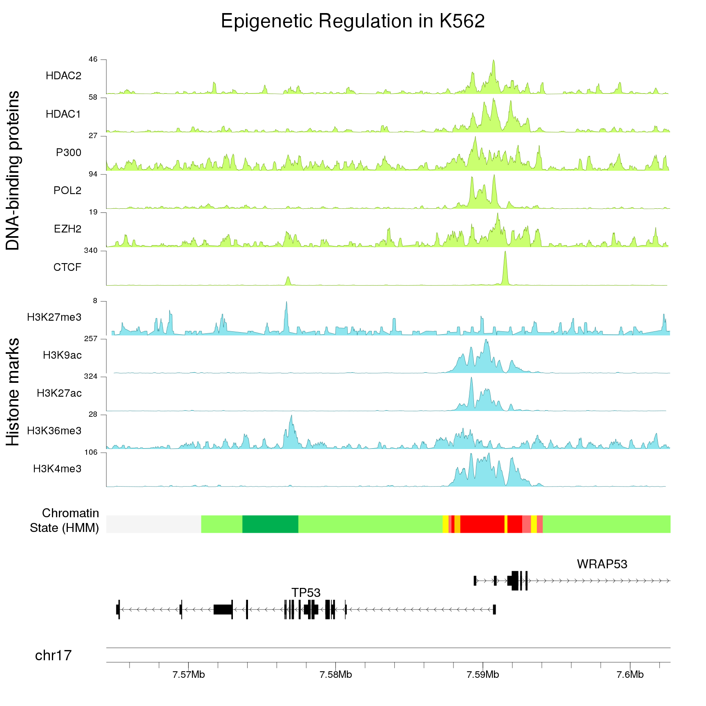


As always with karyoploteR, we can change the plotting region (zoom in this 
case) to plot any part of the genome, for example, a detailed view of the 
overlapping zone.


```r
TP53.promoter.region <- toGRanges("chr17:7586000-7596000")
kp <- plotKaryotype(zoom = TP53.promoter.region, cex=3, plot.params = pp)
kpAddBaseNumbers(kp, tick.dist = 10000, minor.tick.dist = 2000,
                 add.units = TRUE, cex=2, tick.len = 3)
kpAddMainTitle(kp, "Epigenetic Regulation in K562", cex=4)
kpPlotGenes(kp, data=genes.data, r0=0, r1=0.1, gene.name.cex = 2.5)
kpPlotRegions(kp, K562.hmm, col=K562.hmm$itemRgb, r0=0.15, r1=0.18)
kpAddLabels(kp, labels = "Chromatin\nState (HMM)", r0=0.15, r1=0.18, cex=2.5)

#Histone marks
total.tracks <- length(histone.marks)+length(DNA.binding)
out.at <- autotrack(1:length(histone.marks), total.tracks, margin = 0.3, r0=0.23)
kpAddLabels(kp, labels = "Histone marks", r0 = out.at$r0, r1=out.at$r1, cex=3.5,
            srt=90, pos=1, label.margin = 0.14)

for(i in seq_len(length(histone.marks))) {
  bigwig.file <- paste0(base.url, histone.marks[i])
  at <- autotrack(i, length(histone.marks), r0=out.at$r0, r1=out.at$r1, margin = 0.1)
  kp <- kpPlotBigWig(kp, data=bigwig.file, ymax="visible.region",
                     r0=at$r0, r1=at$r1, col = "cadetblue2")
  computed.ymax <- ceiling(kp$latest.plot$computed.values$ymax)
  kpAxis(kp, ymin=0, ymax=computed.ymax, tick.pos = computed.ymax, 
         r0=at$r0, r1=at$r1, cex=1.6)
  kpAddLabels(kp, labels = names(histone.marks)[i], r0=at$r0, r1=at$r1, 
              cex=2.2, label.margin = 0.035)
}

#DNA binding proteins
out.at <- autotrack((length(histone.marks)+1):total.tracks, total.tracks, margin = 0.3, r0=0.23)

kpAddLabels(kp, labels = "DNA-binding proteins", r0 = out.at$r0, r1=out.at$r1,
             cex=3.5, srt=90, pos=1, label.margin = 0.14)
for(i in seq_len(length(DNA.binding))) {
  bigwig.file <- paste0(base.url, DNA.binding[i])
  at <- autotrack(i, length(DNA.binding), r0=out.at$r0, r1=out.at$r1, margin = 0.1)
  kp <- kpPlotBigWig(kp, data=bigwig.file, ymax="visible.region",
                     r0=at$r0, r1=at$r1, col = "darkolivegreen1")
  computed.ymax <- ceiling(kp$latest.plot$computed.values$ymax)
  kpAxis(kp, ymin=0, ymax=computed.ymax, tick.pos = computed.ymax, 
         r0=at$r0, r1=at$r1, cex=1.6)
  kpAddLabels(kp, labels = names(DNA.binding)[i], r0=at$r0, r1=at$r1, 
              cex=2.2, label.margin = 0.035)
}
```

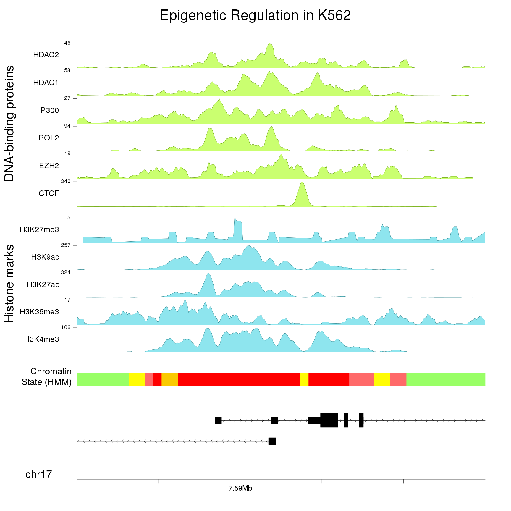

