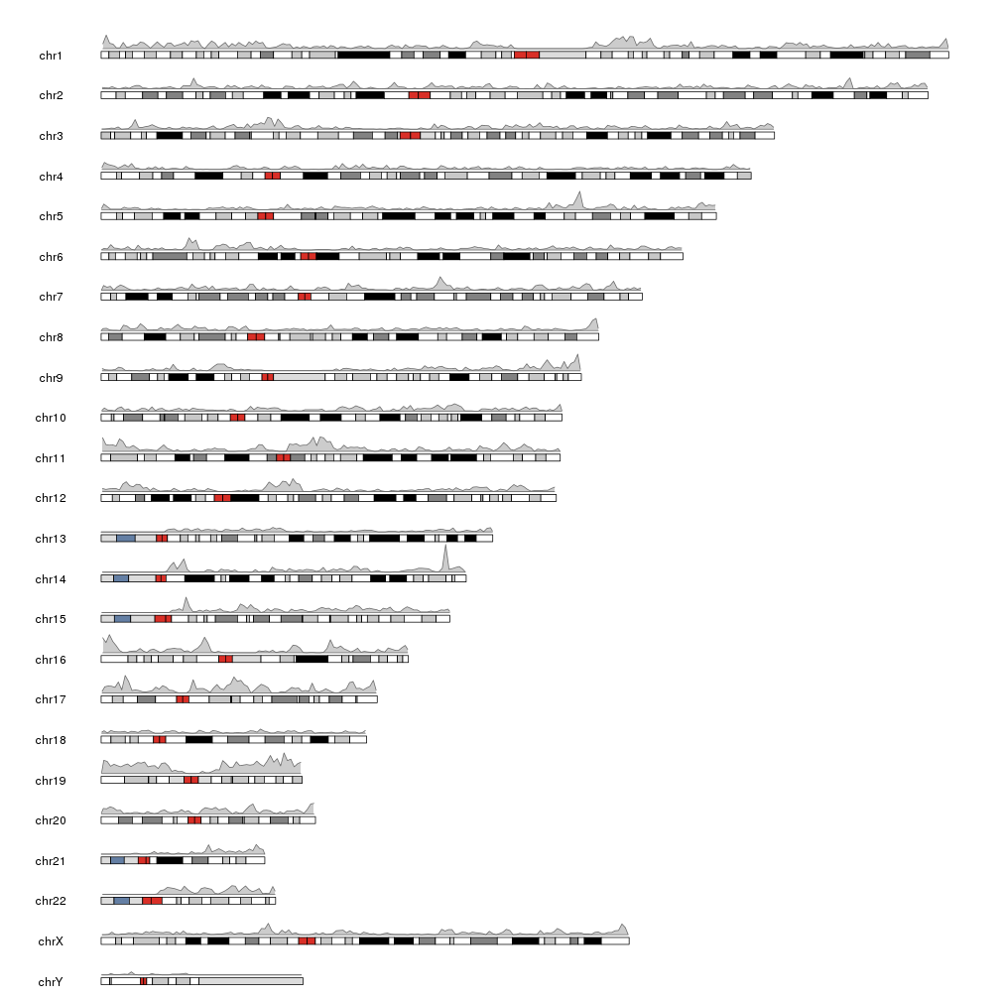
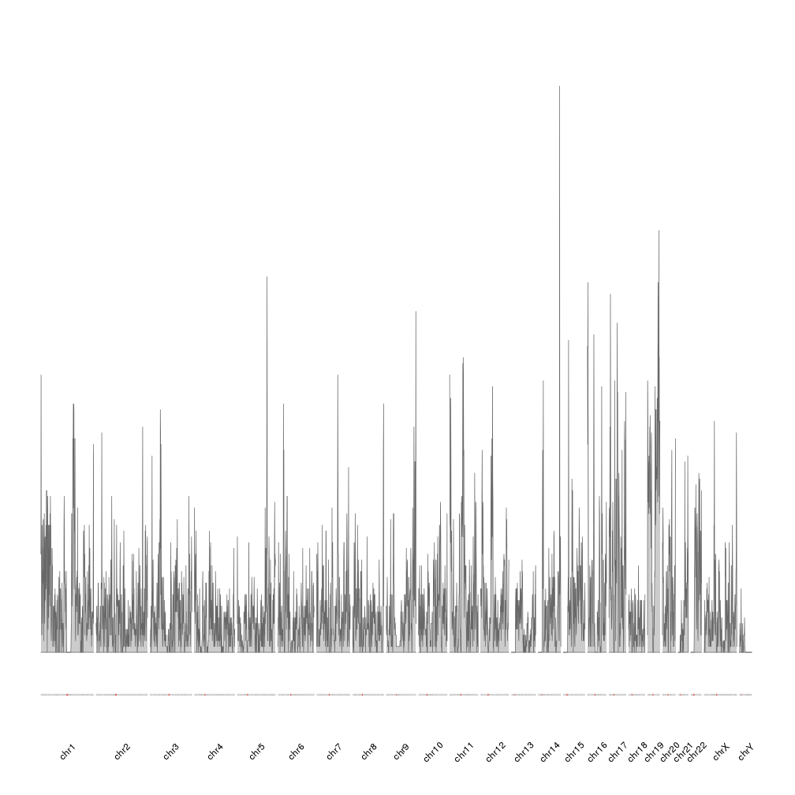
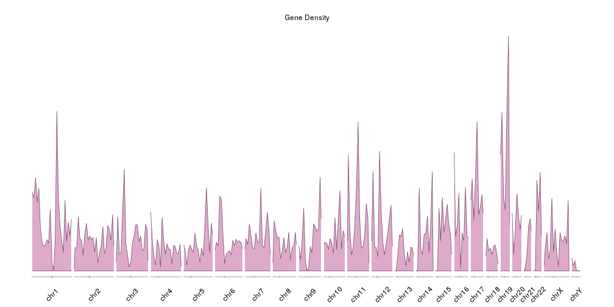

## Gene Density

This example shows how to plot the density of genes along the genome. We'll need 
the position of all human genes and we'll get it from the 
[TxDb.Hsapiens.UCSC.hg19.knownGene](https://bioconductor.org/packages/TxDb.Hsapiens.UCSC.hg19.knownGene)
Bioconductor package. 

We'll start by using the _genes_ function to create a GRanges object
with all genes.


```r
library(TxDb.Hsapiens.UCSC.hg19.knownGene)
txdb <- TxDb.Hsapiens.UCSC.hg19.knownGene
all.genes <- genes(txdb)
head(all.genes)
```

```
## GRanges object with 6 ranges and 1 metadata column:
##             seqnames                 ranges strand |     gene_id
##                <Rle>              <IRanges>  <Rle> | <character>
##           1    chr19 [ 58858172,  58874214]      - |           1
##          10     chr8 [ 18248755,  18258723]      + |          10
##         100    chr20 [ 43248163,  43280376]      - |         100
##        1000    chr18 [ 25530930,  25757445]      - |        1000
##       10000     chr1 [243651535, 244006886]      - |       10000
##   100008586     chrX [ 49217763,  49233491]      + |   100008586
##   -------
##   seqinfo: 93 sequences (1 circular) from hg19 genome
```

To plot the density of the genes we'll use karyoploteR's _kpPlotDensity_, 
a function that computed the density of a GRanges object over the genome 
and plots it. 


```r
library(karyoploteR)
kp <- plotKaryotype(genome="hg19")
kp <- kpPlotDensity(kp, all.genes)
```




This plot is correct and has the information we need, but it would be nice to 
ba able to compare the density of the different chromosomes by having them one
next to the other in a single line. We can achieve this simply changing the
plot.type to 3, 4 or 5. In our case we'll use plot.type=4, the plot with the 
ideogram on the bottom of the plot and the data above it. More information 
about the available plot types can be found at the [vignette](https://www.bioconductor.org/packages/devel/bioc/vignettes/karyoploteR/inst/doc/karyoploteR.html#types-of-plots).
We will also omit the default creation of the ideograms and chromosome labels
and explicitly call the functions to better control their look.


```r
kp <- plotKaryotype(genome="hg19", plot.type=4, ideogram.plotter = NULL, labels.plotter = NULL)
kpAddCytobandsAsLine(kp)
kpAddChromosomeNames(kp, srt=45)
kpPlotDensity(kp, all.genes)
```



It is now easier to compare the density between the chromosomes, but the 
data is maybe too "spyky" for a genome-wide view. We can smoothen it 
using a larger window size in the density computation. For example we can set 
window.size to 10Mb instead of the default 1Mb. In addition we'll adjust the
plotting parameters to reduce some of the blank space. In addition we'll make 
the plot height smaller to get a more adequate aspect ratio.


```r
pp <- getDefaultPlotParams(plot.type = 4)
pp$data1inmargin <- 0
pp$bottommargin <- 20

kp <- plotKaryotype(genome="hg19", plot.type=4, ideogram.plotter = NULL,
                    labels.plotter = NULL, plot.params = pp,
                    main="Gene Density")
kpAddCytobandsAsLine(kp)
kpAddChromosomeNames(kp, srt=45)
kpPlotDensity(kp, all.genes, window.size = 10e6, col="#ddaacc")
```


