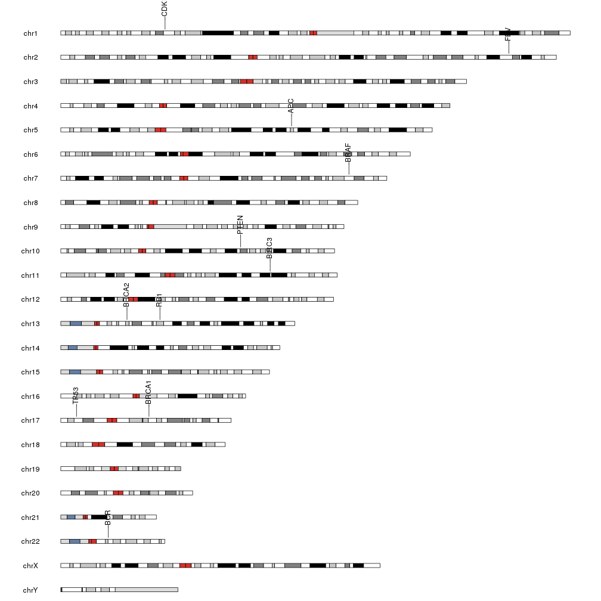
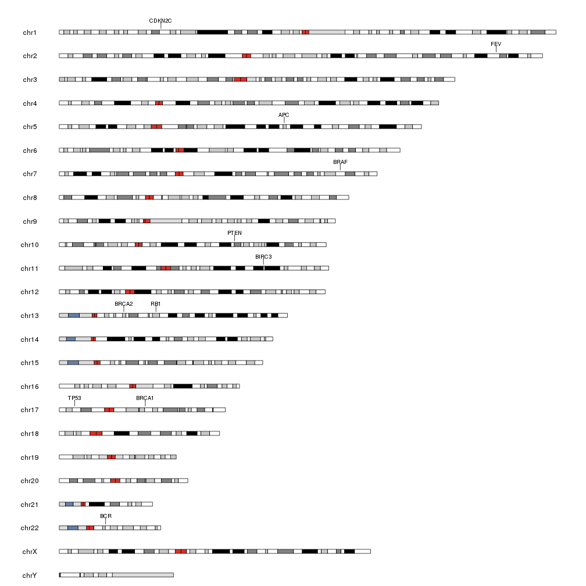

## Plot Genes

This example shows how to determine the position of some genes in the genome 
and create a plot showing them. We'll use Ensembl's Biomart database to 
automatically retrieve their position using the [biomaRt](https://bioconductor.org/packages/biomaRt)
Bioconductor package. We'll automatically convert the returned data frame into 
a GRanges with regioneR's `toGRanges` and since our genome is from UCSC, we'll
need to change the chromosome name style from Ensembl to UCSC with
`seqlevelsStyle`. We'll use genome GRCh38, the one used in the current biomart
version.


```r
library(biomaRt)
library(regioneR)
gene.symbols <- c("AKT", "APC", "BCR", "BIRC3", "BRAF", "BRCA1", "BRCA2", "CDKN2C", "FEV", "TP53", "PTEN", "RB1")
ensembl <- useEnsembl(biomart="ensembl", dataset="hsapiens_gene_ensembl")
genes <- toGRanges(getBM(attributes=c('chromosome_name', 'start_position', 'end_position', 'hgnc_symbol'),
               filters = 'hgnc_symbol', values =gene.symbols, mart = ensembl))
seqlevelsStyle(genes) <- "UCSC"

head(genes)
```

```
## GRanges object with 6 ranges and 1 metadata column:
##       seqnames                 ranges strand | hgnc_symbol
##          <Rle>              <IRanges>  <Rle> |    <factor>
##   [1]     chr5 [112707498, 112846239]      * |         APC
##   [2]    chr22 [ 23179704,  23318037]      * |         BCR
##   [3]    chr11 [102317450, 102339403]      * |       BIRC3
##   [4]     chr7 [140719327, 140924764]      * |        BRAF
##   [5]    chr17 [ 43044295,  43170245]      * |       BRCA1
##   [6]    chr13 [ 32315474,  32400266]      * |       BRCA2
##   -------
##   seqinfo: 9 sequences from an unspecified genome; no seqlengths
```

Once we have the data prepared we can use `kpPlotMarkers` to plot them on the
genome.


```r
library(karyoploteR) 
kp <- plotKaryotype(genome="hg38")
kpPlotMarkers(kp, data=genes, labels=genes$hgnc_symbol)
```



The gene labels are not readable since they overlap the ideograms. To solve this
we will tweak the plot a bit: make the labels horizontal, reduce them and move
them closer to their ideograms specifying lower r1 and adjusting the label.margin.


```r
kp <- plotKaryotype(genome="hg38")
kpPlotMarkers(kp, data=genes, labels=genes$hgnc_symbol, text.orientation = "horizontal",
              r1=0.5, cex=0.8, adjust.label.position = FALSE)
```


