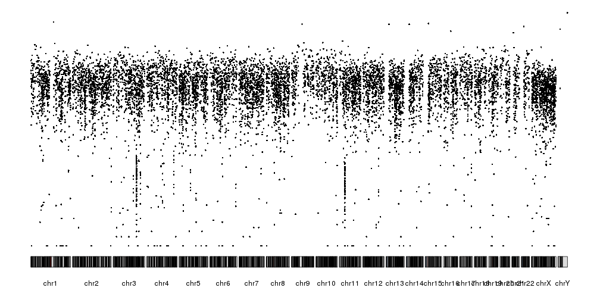
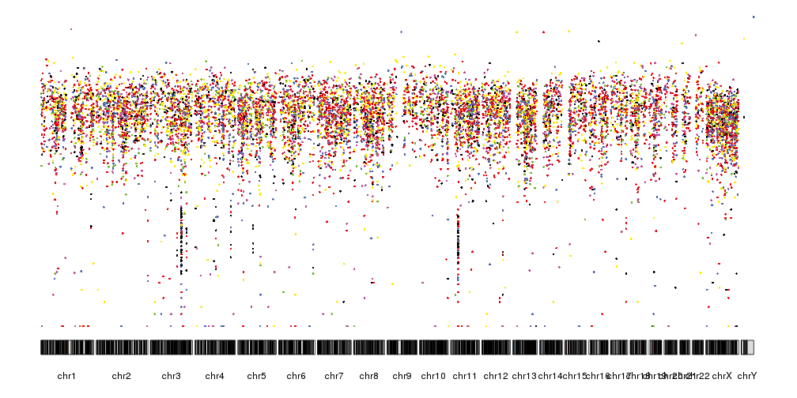
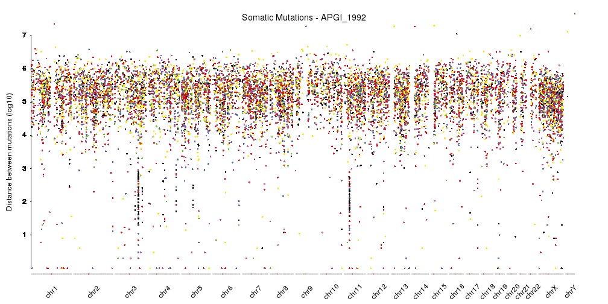
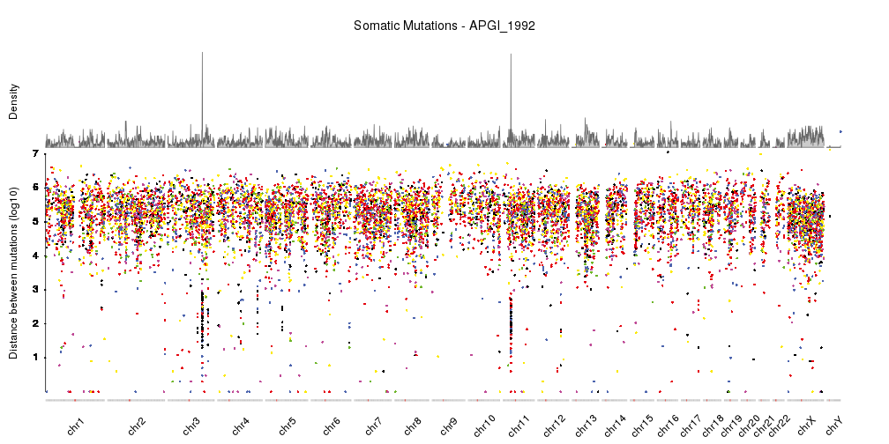
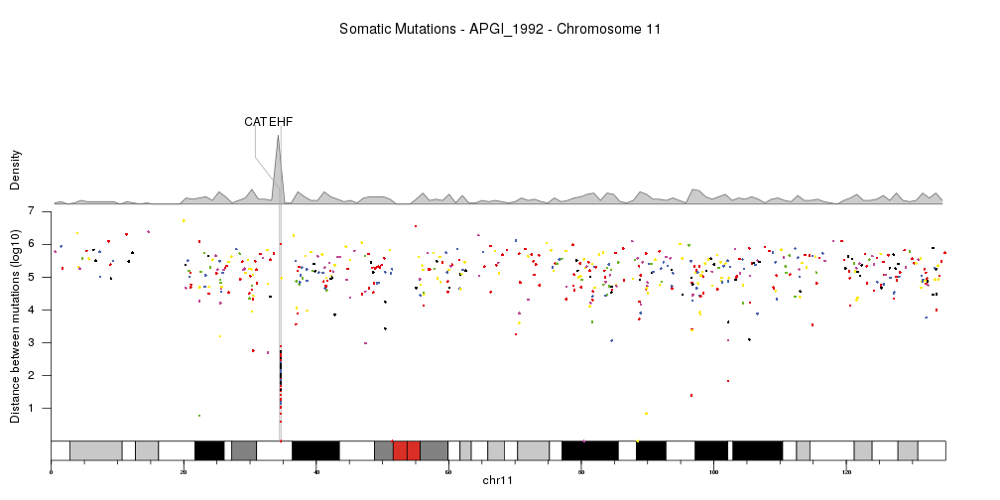

## Rainfall Plots

Rainfall plots show the distances between consecutive genomic features in a 
logarithmic scale, so regions with a concentration of such features can be
identified as a drop in the distance between features. Rainfall plots were
first introduced in [Nik-Zainal _et al._, 2012](http://www.cell.com/cell/fulltext/S0092-8674(12)00528-4)
and are usually used to plot the distances between cancer somatic mutations
and to identify regions of the genome with a higher than usual mutation rate.

For this example we'll use WGS somatic mutation data for pancreas cancer from 
[Alexandrov _et al._, 2012](http://www.cell.com/cell-reports/fulltext/S2211-1247(12)00433-0) 
that can be downloaded from the Sanger Institute FTP server at 
[ftp://ftp.sanger.ac.uk/pub/cancer/AlexandrovEtAl/](ftp://ftp.sanger.ac.uk/pub/cancer/AlexandrovEtAl/).
There's data for multiple other cancer types and data is in a tabular format.


```r
somatic.mutations <- read.table(file="ftp://ftp.sanger.ac.uk/pub/cancer/AlexandrovEtAl/somatic_mutation_data/Pancreas/Pancreas_raw_mutations_data.txt", header=FALSE, sep="\t", stringsAsFactors=FALSE)
somatic.mutations <- setNames(somatic.mutations, c("sample", "mut.type", "chr", "start", "end", "ref", "alt", "origin"))
head(somatic.mutations)
```

```
##    sample mut.type chr     start       end    ref alt        origin
## 1 8014741    indel  11 108150257 108150257      G   - ORIGINAL-DATA
## 2 8014741    indel   6  47645613  47645618 GGCCAC   - ORIGINAL-DATA
## 3 8014741     subs  11 102663435 102663435      C   T ORIGINAL-DATA
## 4 8014741     subs   1 157095639 157095639      C   T ORIGINAL-DATA
## 5 8014741     subs  12 126929530 126929530      T   C ORIGINAL-DATA
## 6 8014741     subs  12  25398283  25398283      A   C ORIGINAL-DATA
```

We'll split the data by sample and work with the data from a single sample: 
APGI_1992. Once we have the data for the single sample, we will transform it
to a genomic ranges object using 
[regioneR's](https://bioconductor.org/packages/regioneR) `toGRanges` function 
and convert it to use UCSC chromosome names so it's compatible with the
standard genomes in Bioconductor.


```r
library(regioneR)
somatic.mutations <- split(somatic.mutations, somatic.mutations$sample)
sm <- somatic.mutations[["APGI_1992"]]
sm.gr <- toGRanges(sm[,c("chr", "start", "end", "mut.type", "ref", "alt")])
seqlevelsStyle(sm.gr) <- "UCSC"
sm.gr
```

```
## GRanges object with 10170 ranges and 3 metadata columns:
##           seqnames                 ranges strand |    mut.type         ref
##              <Rle>              <IRanges>  <Rle> | <character> <character>
##       [1]    chr10 [100455463, 100455463]      * |        subs           T
##       [2]    chr10 [100463182, 100463182]      * |        subs           C
##       [3]    chr10 [100922694, 100922694]      * |        subs           C
##       [4]    chr10 [101137819, 101137819]      * |        subs           C
##       [5]    chr10 [101200589, 101200589]      * |        subs           G
##       ...      ...                    ...    ... .         ...         ...
##   [10166]     chrX   [99576784, 99576784]      * |        subs           T
##   [10167]     chrX   [99762728, 99762728]      * |        subs           A
##   [10168]     chrY   [13269826, 13269826]      * |        subs           T
##   [10169]     chrY   [13417920, 13417920]      * |        subs           G
##   [10170]     chrY   [59020275, 59020275]      * |        subs           C
##                   alt
##           <character>
##       [1]           C
##       [2]           T
##       [3]           T
##       [4]           A
##       [5]           C
##       ...         ...
##   [10166]           C
##   [10167]           G
##   [10168]           C
##   [10169]           C
##   [10170]           A
##   -------
##   seqinfo: 24 sequences from an unspecified genome; no seqlengths
```

Once we have a GRanges with the variants (or any other genomic feature), we 
can create the rainfall plot with the function `kpPlotRainfall`. This function
needs a `KaryoPlot` object and a GRanges. We'll use the plot type number 4,
with all chromosomes in a single line, since rainfall plots are usually plotted
this way.


```r
library(karyoploteR)
kp <- plotKaryotype(plot.type=4)
kpPlotRainfall(kp, data = sm.gr)
```



In addition to the distance between consecutive mutations we can plot the 
different nucleotide substitutions in different colors. To assign a color
to each variant we'll use the `getVariantsColors` function, giving it the
reference and alternative base for each variant.


```r
variant.colors <- getVariantsColors(sm.gr$ref, sm.gr$alt)
kp <- plotKaryotype(plot.type=4)
kpPlotRainfall(kp, data = sm.gr, col=variant.colors)
```



It is now quite similar the rainfall plots we can see in the 
[original publication](http://www.cell.com/cell/fulltext/S0092-8674(12)00528-4)
but we can further refine by changing the ideograms to a lighter version, adjust
some of the margins and rotate the chromosome labels so they don't overlap. 
We can also add a main title and a y axis.


```r
pp <- getDefaultPlotParams(plot.type = 4)
pp$data1inmargin <- 0
pp$bottommargin <- 20

kp <- plotKaryotype(plot.type=4, ideogram.plotter = NULL,
                    labels.plotter = NULL, plot.params = pp)
kpAddCytobandsAsLine(kp)
kpAddChromosomeNames(kp, srt=45)
kpAddMainTitle(kp, main="Somatic Mutations - APGI_1992", cex=1.2)
kpAxis(kp, ymax = 7, tick.pos = 1:7)
kpPlotRainfall(kp, data = sm.gr, col=variant.colors)
kpAddLabels(kp, labels = c("Distance between mutations (log10)"), srt=90, pos=1, label.margin = 0.04)
```



With this, we have a nicely finished rainfall plot, but since we are working with
karyoploteR we can easily add additional information combined with the rainfall 
plot. For example, we can add a density plot, as done in 
[Domanska _et al._](https://bmcbioinformatics.biomedcentral.com/articles/10.1186/s12859-017-1679-8).


```r
kp <- plotKaryotype(plot.type=4, ideogram.plotter = NULL,
                    labels.plotter = NULL, plot.params = pp)
kpAddCytobandsAsLine(kp)
kpAddChromosomeNames(kp, srt=45)
kpAddMainTitle(kp, main="Somatic Mutations - APGI_1992", cex=1.2)
kpPlotRainfall(kp, data = sm.gr, col=variant.colors, r0=0, r1=0.7)
kpAxis(kp, ymax = 7, tick.pos = 1:7, r0=0, r1=0.7)
kpAddLabels(kp, labels = c("Distance between mutations (log10)"), srt=90, pos=1, label.margin = 0.04, r0=0, r1=0.7)
kpPlotDensity(kp, data = sm.gr, r0=0.72, r1=1)
kpAddLabels(kp, labels = c("Density"), srt=90, pos=1, label.margin = 0.04, r0=0.71, r1=1)
```



Or show a single chromosome and add a few genes in the kataegis region. 
In this cas we'll change the order in which the different parts
are plotted, so the genes are above the density but below the rainfall plot.


```r
kata.genes <- toGRanges(data.frame(chr=c("chr11"),
                        start=c(34460472,34642588),
                        end=c(34460561,34684834),
                        labels=c("CAT","EHF"),
                        stringsAsFactors = FALSE))

kp <- plotKaryotype(plot.type=4, plot.params = pp,
                    chromosomes="chr11")
kpAddMainTitle(kp, main="Somatic Mutations - APGI_1992 - Chromosome 11", cex=1.2)
kpAddBaseNumbers(kp)
kpPlotDensity(kp, data = sm.gr, window.size = 10e5, r0=0.62, r1=0.8)
kpAddLabels(kp, labels = c("Density"), srt=90, pos=1, label.margin = 0.04, r0=0.62, r1=0.8)
kpPlotMarkers(kp, data = kata.genes, text.orientation = "horizontal", r1=1.1, line.color = "#AAAAAA")
kpPlotRainfall(kp, data = sm.gr, col=variant.colors, r0=0, r1=0.6)
kpAxis(kp, ymax = 7, tick.pos = 1:7, r0=0, r1=0.6)
kpAddLabels(kp, labels = c("Distance between mutations (log10)"), srt=90, pos=1, label.margin = 0.04, r0=0, r1=0.6)
```


