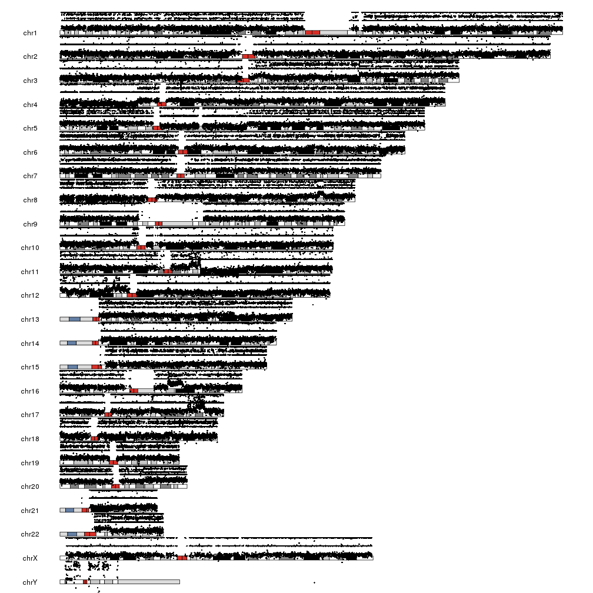
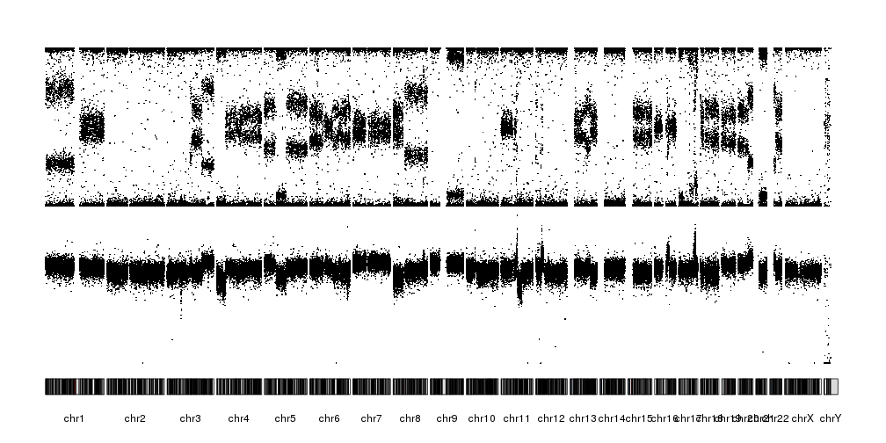
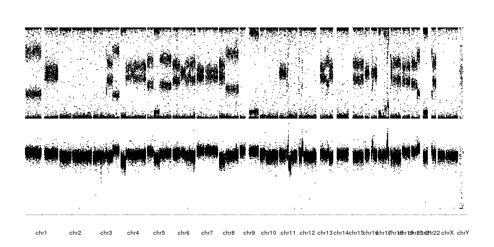
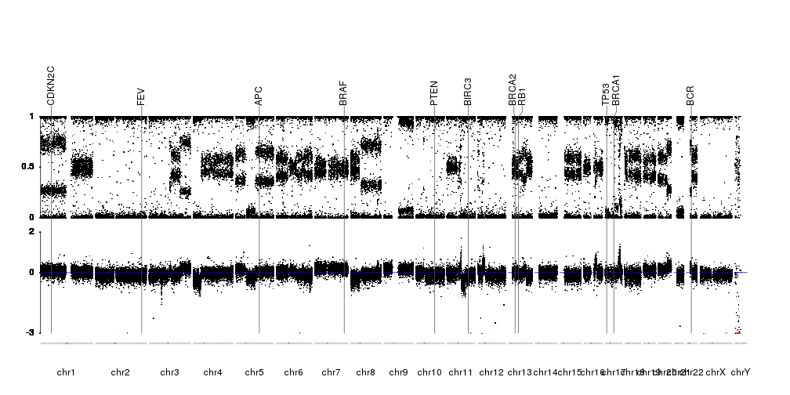

## Plot SNP array raw data

In addition to genotyping, SNP arrays are good tools for copy number calling. To
do that, we need to take into account not the individual genotypes of each SNP
in the array, but the general shape and values of the raw data. Good tools exist 
for that, but visualizing the raw data is an important step and a quality control.

In this example we'll use data from a cancer cell line obtained with an Illumina
OmniExpress array. The data file has been downsampled to only 100k snps, but 
other from that is the standard "_FinalReport_" one gets from GenomeStudio.


```r
library(karyoploteR)
dd <- read.table(file = "../data/SNPArray.26T.txt.gz", sep="\t", header=TRUE, stringsAsFactors = FALSE)
```

```
## Error in file(file, "rt"): cannot open the connection
```

```r
head(dd)
```

```
##     SNP.Name Sample.ID Allele1...Top Allele2...Top GC.Score Sample.Name
## 1 rs11152336        34             A             C   0.7622         26T
## 2  rs4458740        34             A             C   0.8454         26T
## 3  rs4264565        34             C             C   0.8317         26T
## 4  rs4474684        34             G             G   0.7729         26T
## 5  rs7677662        34             A             A   0.7739         26T
## 6  rs4682434        34             A             C   0.4395         26T
##   Sample.Group Sample.Index SNP.Index SNP.Aux Allele1...Forward
## 1          26T           32     81073       0                 A
## 2          26T           32    443708       0                 A
## 3          26T           32    434421       0                 C
## 4          26T           32    444477       0                 C
## 5          26T           32    613842       0                 A
## 6          26T           32    456548       0                 T
##   Allele2...Forward Allele1...Design Allele2...Design Allele1...AB
## 1                 C                A                C            A
## 2                 C                T                G            A
## 3                 C                G                G            B
## 4                 C                C                C            B
## 5                 A                A                A            A
## 6                 G                A                C            A
##   Allele2...AB Allele1...Plus Allele2...Plus Chr  Position GT.Score
## 1            B              A              C  18  59864223   0.7679
## 2            B              A              C   7 156089537   0.8203
## 3            B              C              C   2 215283259   0.8107
## 4            B              C              C  16    951045   0.7734
## 5            A              A              A   4 145513053   0.7741
## 6            B              T              G   3 112534069   0.7903
##   Cluster.Sep   SNP ILMN.Strand Customer.Strand Top.Genomic.Sequence
## 1      0.7687 [A/C]         TOP             TOP                   NA
## 2      0.7304 [T/G]         BOT             TOP                   NA
## 3      1.0000 [T/G]         BOT             TOP                   NA
## 4      0.9690 [T/C]         BOT             BOT                   NA
## 5      0.9954 [A/G]         TOP             TOP                   NA
## 6      0.6738 [A/C]         TOP             BOT                   NA
##   Plus.Minus.Strand Theta     R     X     Y X.Raw Y.Raw B.Allele.Freq
## 1                 + 0.651 0.642 0.243 0.398  1266  1753        0.6157
## 2                 - 0.615 1.137 0.465 0.672  2350  2903        0.4573
## 3                 - 0.972 1.266 0.053 1.213   486  5697        1.0000
## 4                 + 0.974 1.161 0.046 1.115   432  4710        1.0000
## 5                 + 0.033 1.369 1.300 0.068  6213   460        0.0000
## 6                 - 0.330 0.465 0.296 0.169  1744   866        0.3379
##   Log.R.Ratio CNV.Value CNV.Confidence GC_probe GCC_LRR
## 1     -0.3307        NA             NA     0.31   -0.26
## 2      0.1754        NA             NA     0.44    0.18
## 3     -0.0784        NA             NA     0.31   -0.01
## 4     -0.1139        NA             NA     0.62   -0.15
## 5     -0.0547        NA             NA     0.36   -0.01
## 6     -0.1655        NA             NA     0.30   -0.10
```

to plot it we'll first extract the information we need and convert it into a 
GRanges using the toGRanges function from regioneR and setting start and end 
to the snp position. The data we need is the B-allele frequency (BAF), that is,
the portion of the signal coming from the allele labeled as B, and the 
Log R Ratio (LRR), that is, the total amount of signal. We'll need to change 
the chromosome names from the Ensembl style to the UCSC style, since we are
using the standard hg19 genome.


```r
snp.data <- toGRanges(dd[,c("Chr", "Position", "Position", "B.Allele.Freq", "Log.R.Ratio")])
names(mcols(snp.data)) <- c("BAF", "LRR")
seqlevelsStyle(snp.data) <- "UCSC"
head(snp.data)
```

```
## GRanges object with 6 ranges and 2 metadata columns:
##       seqnames                 ranges strand |       BAF       LRR
##          <Rle>              <IRanges>  <Rle> | <numeric> <numeric>
##   [1]    chr18 [ 59864223,  59864223]      * |    0.6157   -0.3307
##   [2]     chr7 [156089537, 156089537]      * |    0.4573    0.1754
##   [3]     chr2 [215283259, 215283259]      * |         1   -0.0784
##   [4]    chr16 [   951045,    951045]      * |         1   -0.1139
##   [5]     chr4 [145513053, 145513053]      * |         0   -0.0547
##   [6]     chr3 [112534069, 112534069]      * |    0.3379   -0.1655
##   -------
##   seqinfo: 26 sequences from an unspecified genome; no seqlengths
```

And we are ready to plot. We'll create a scatter plot using the _kpPoints_
function and we'll plot the BAF in the upper part of the data panel 
(_r0=0.5_ and _r1=1_) and the LRR in the lower part (_r0=0_ and _r1=0.5_).


```r
kp <- plotKaryotype()
kpPoints(kp, data=snp.data, y=snp.data$BAF, r0=0.5, r1=1)
kpPoints(kp, data=snp.data, y=snp.data$LRR, r0=0, r1=0.5)
```



There are a few problems with this plot. First, we have BAF is in the [0,1] range
but LRR is not, and it's bleeding over the ideograms. Second, the points are
too big to reveal the patterns, specially with the chromosomes one over the other.
To solve this, we'll change to another plot type with all chromosomes in a line,
_plot.type=4_. We'll deal with the overflowing LRR by setting a different _ymin_
and cutting the points below that.


```r
lrr.below.min <- which(snp.data$LRR < -3)
snp.data$LRR[lrr.below.min] <- -3

kp <- plotKaryotype(plot.type = 4)
kpPoints(kp, data=snp.data, y=snp.data$BAF, cex=0.3, r0=0.5, r1=1)
kpPoints(kp, data=snp.data, y=snp.data$LRR, cex=0.3, r0=0, r1=0.5, ymax=2, ymin=-3)
```



It is now possible to see the patterns of alteration, both in the BAF and the 
LRR. We can further refine the plot by reducing the margin between the data and
the ideograms and changing the ideograms with a single line with the centromere.


```r
pp <- getDefaultPlotParams(plot.type = 4)
pp$data1inmargin <- 2
kp <- plotKaryotype(plot.type = 4, ideogram.plotter = NULL, plot.params = pp)
kpAddCytobandsAsLine(kp)
kpPoints(kp, data=snp.data, y=snp.data$BAF, cex=0.3, r0=0.5, r1=1)
kpPoints(kp, data=snp.data, y=snp.data$LRR, cex=0.3, r0=0, r1=0.5, ymax=2, ymin=-3)
```



Finally, we'll mark in red the points below _ymin_ to mark they were cropped,
we'll add markers for a couple of genes, add axis were needed and a line marking
the 0 LRR. The information on the position of the genes will come from Ensembl
Biomart as in the Plot Genes example.


```r
library(biomaRt)
gene.symbols <- c("AKT", "APC", "BCR", "BIRC3", "BRAF", "BRCA1", "BRCA2", "CDKN2C", "FEV", "TP53", "PTEN", "RB1")
ensembl <- useEnsembl(biomart="ensembl", dataset="hsapiens_gene_ensembl", version=67)
```

```
## Note: requested host was redirected from e67.ensembl.org to http://may2012.archive.ensembl.org:80/biomart/martservice
## When using archived Ensembl versions this sometimes can result in connecting to a newer version than the intended Ensembl version
## Check your ensembl version using listMarts(mart)
```

```r
genes <- toGRanges(getBM(attributes=c('chromosome_name', 'start_position', 'end_position', 'hgnc_symbol'),
               filters = 'hgnc_symbol', values =gene.symbols, mart = ensembl))
seqlevelsStyle(genes) <- "UCSC"


pp <- getDefaultPlotParams(plot.type = 4)
pp$data1inmargin <- 2

kp <- plotKaryotype(plot.type = 4, ideogram.plotter = NULL, plot.params = pp)
kpAddCytobandsAsLine(kp)
kpAxis(kp, r0=0.4, r1=0.75)
kpPoints(kp, data=snp.data, y=snp.data$BAF, cex=0.3, r0=0.4, r1=0.75)
kpAxis(kp, tick.pos = c(-3, 0, 2), r0=0, r1=0.35, ymax=2, ymin=-3)
kpPoints(kp, data=snp.data, y=snp.data$LRR, cex=0.3, r0=0, r1=0.35, ymax=2, ymin=-3)
kpPoints(kp, data=snp.data[lrr.below.min], y=snp.data[lrr.below.min]$LRR, cex=0.3, r0=0, r1=0.35, ymax=2, ymin=-3, col="red")
kpAbline(kp, h=0, r0=0, r1=0.35, ymax=2, ymin=-3, col="blue")
kpPlotMarkers(kp, data=genes, labels=genes$hgnc_symbol, line.color = "#555555", marker.parts = c(0.95,0.025,0.025),  r1=1.05)
```


