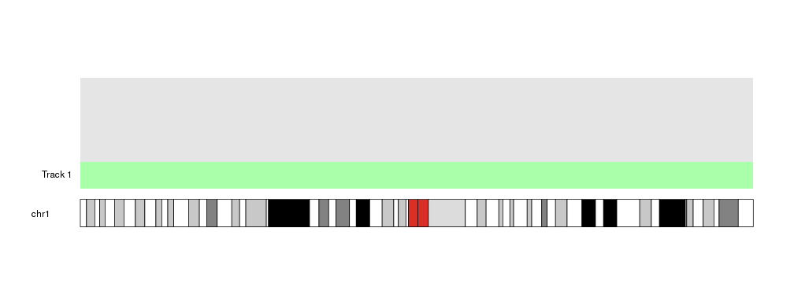
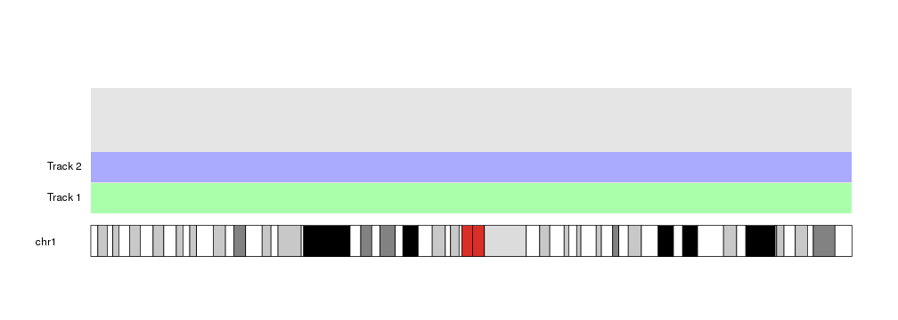
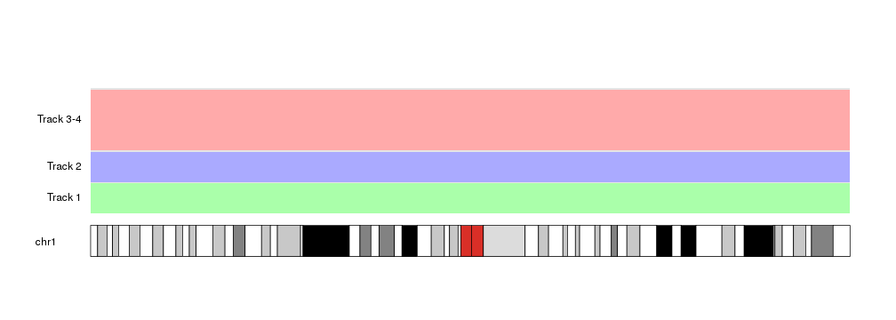
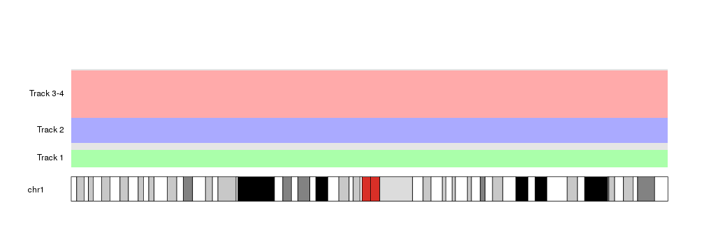
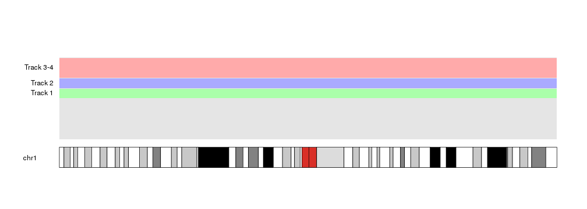
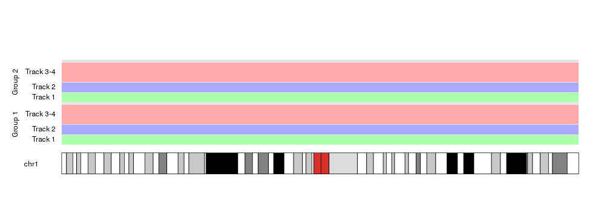
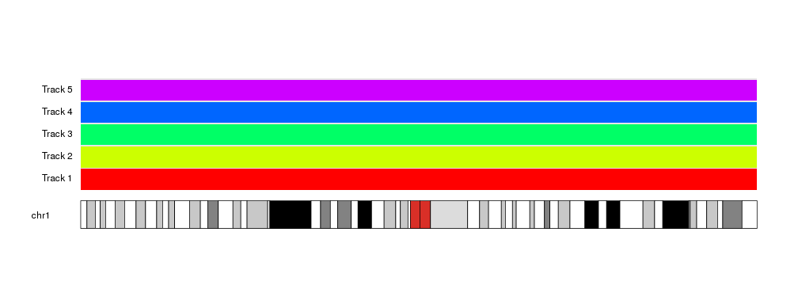
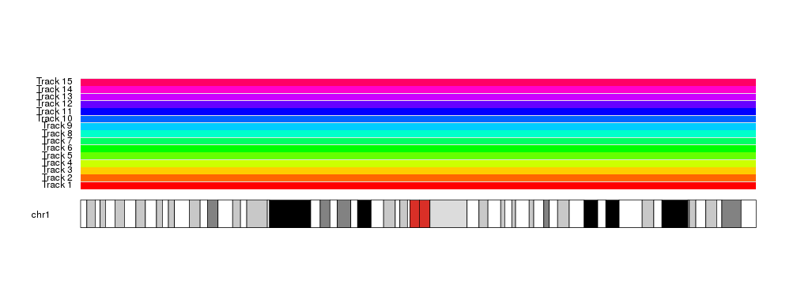

## Automated Data Positioning in karyoploteR

As seen in the 
[data positioning]({{ site.baseurl }})
section, `r0`and `r1`can be used to define the vertical regions of the
data panels where a function will plot. 

While in many cases we will manually define the `r0` and `r1` values, in some
circumstances it can be useful to have an automatic way of computing them. 
This is the mission of the `autotrack` function.

`autotrack` will help us partition the vertical space in a number of equally 
sized "tracks", separated by a small margin. 

Each call to `autotrack` will give us the `r0` and `r1` values for one of these
tracks.

For example, if we want to partition the data panel into 4 tracks and get the 
`r0`and `r1` for the first (the bottom) one, we will use this:


```r
library(karyoploteR)

autotrack(current.track = 1, total.tracks = 4)
```

```
## $r0
## [1] 0
## 
## $r1
## [1] 0.2375
```

We can then use this object to set the `r0`and `r1` in any plotting function:


```r
kp <- plotKaryotype(chromosomes = "chr1")
kpDataBackground(kp)
at <- autotrack(current.track = 1, total.tracks = 4)
kpDataBackground(kp, r0=at$r0, r1=at$r1, color = "#AAFFAA")
kpAddLabels(kp, labels = "Track 1", r0=at$r0, r1=at$r1)
```



Changing the value of `current.track` we can then get the vertical position of 
the second track.


```r
kp <- plotKaryotype(chromosomes = "chr1")
kpDataBackground(kp)
at <- autotrack(current.track = 1, total.tracks = 4)
kpDataBackground(kp, r0=at$r0, r1=at$r1, color = "#AAFFAA")
kpAddLabels(kp, labels = "Track 1", r0=at$r0, r1=at$r1)

at <- autotrack(current.track = 2, total.tracks = 4)
kpDataBackground(kp, r0=at$r0, r1=at$r1, color = "#AAAAFF")
kpAddLabels(kp, labels = "Track 2", r0=at$r0, r1=at$r1)
```


```r
kp <- plotKaryotype(chromosomes = "chr1")
kpDataBackground(kp)
at <- autotrack(current.track = 1, total.tracks = 4)
kpDataBackground(kp, r0=at$r0, r1=at$r1, color = "#AAFFAA")
kpAddLabels(kp, labels = "Track 1", r0=at$r0, r1=at$r1)

at <- autotrack(current.track = 2, total.tracks = 4)
kpDataBackground(kp, r0=at$r0, r1=at$r1, color = "#AAAAFF")
kpAddLabels(kp, labels = "Track 2", r0=at$r0, r1=at$r1)
```



The `current.margin` parameter can be not a single integer but an array
of integers. In that case, it will return the `r0` at the bottom of the 
track corresponding to the minimum of the values, and `r1` corresponding to 
the top of the maximum one. 


```r
kp <- plotKaryotype(chromosomes = "chr1")
kpDataBackground(kp)
at <- autotrack(current.track = 1, total.tracks = 4)
kpDataBackground(kp, r0=at$r0, r1=at$r1, color = "#AAFFAA")
kpAddLabels(kp, labels = "Track 1", r0=at$r0, r1=at$r1)

at <- autotrack(current.track = 2, total.tracks = 4)
kpDataBackground(kp, r0=at$r0, r1=at$r1, color = "#AAAAFF")
kpAddLabels(kp, labels = "Track 2", r0=at$r0, r1=at$r1)

at <- autotrack(current.track = c(3,4), total.tracks = 4)
kpDataBackground(kp, r0=at$r0, r1=at$r1, color = "#FFAAAA")
kpAddLabels(kp, labels = "Track 3-4", r0=at$r0, r1=at$r1)
```



As you can see, there's a small margin between tracks. By default it is 0.05,
that is, a 5% of the total space for each track. We can modify it or remove it 
completely setting it to 0.


```r
kp <- plotKaryotype(chromosomes = "chr1")
kpDataBackground(kp)
at <- autotrack(current.track = 1, total.tracks = 4, margin = 0.3)
kpDataBackground(kp, r0=at$r0, r1=at$r1, color = "#AAFFAA")
kpAddLabels(kp, labels = "Track 1", r0=at$r0, r1=at$r1)

at <- autotrack(current.track = 2, total.tracks = 4, margin = 0)
kpDataBackground(kp, r0=at$r0, r1=at$r1, color = "#AAAAFF")
kpAddLabels(kp, labels = "Track 2", r0=at$r0, r1=at$r1)

at <- autotrack(current.track = c(3,4), total.tracks = 4)
kpDataBackground(kp, r0=at$r0, r1=at$r1, color = "#FFAAAA")
kpAddLabels(kp, labels = "Track 3-4", r0=at$r0, r1=at$r1)
```




In addition to that, `autotrack` accepts its own `r0`and `r1` parameters, 
indicating the total vertical space to use for the tracks.

For example, we can repeat the example above but using only the top half of 
the data panel.


```r
kp <- plotKaryotype(chromosomes = "chr1")
kpDataBackground(kp)
at <- autotrack(current.track = 1, total.tracks = 4, r0=0.5, r1=1)
kpDataBackground(kp, r0=at$r0, r1=at$r1, color = "#AAFFAA")
kpAddLabels(kp, labels = "Track 1", r0=at$r0, r1=at$r1)

at <- autotrack(current.track = 2, total.tracks = 4, r0=0.5, r1=1)
kpDataBackground(kp, r0=at$r0, r1=at$r1, color = "#AAAAFF")
kpAddLabels(kp, labels = "Track 2", r0=at$r0, r1=at$r1)

at <- autotrack(current.track = c(3,4), total.tracks = 4, r0=0.5, r1=1)
kpDataBackground(kp, r0=at$r0, r1=at$r1, color = "#FFAAAA")
kpAddLabels(kp, labels = "Track 3-4", r0=at$r0, r1=at$r1)
```



This opens the door to nested `autotrack`s such as this


```r
kp <- plotKaryotype(chromosomes = "chr1")
kpDataBackground(kp)

out.at <- autotrack(current.track = 1, total.tracks = 2)
kpAddLabels(kp, labels = "Group 1", pos=1, label.margin = 0.08, srt=90, r0=out.at$r0, r1=out.at$r1)
at <- autotrack(current.track = 1, total.tracks = 4, r0=out.at$r0, r1=out.at$r1)
kpDataBackground(kp, r0=at$r0, r1=at$r1, color = "#AAFFAA")
kpAddLabels(kp, labels = "Track 1", r0=at$r0, r1=at$r1)

at <- autotrack(current.track = 2, total.tracks = 4, r0=out.at$r0, r1=out.at$r1)
kpDataBackground(kp, r0=at$r0, r1=at$r1, color = "#AAAAFF")
kpAddLabels(kp, labels = "Track 2", r0=at$r0, r1=at$r1)

at <- autotrack(current.track = c(3,4), total.tracks = 4, r0=out.at$r0, r1=out.at$r1)
kpDataBackground(kp, r0=at$r0, r1=at$r1, color = "#FFAAAA")
kpAddLabels(kp, labels = "Track 3-4", r0=at$r0, r1=at$r1)


out.at <- autotrack(current.track = 2, total.tracks = 2)
kpAddLabels(kp, labels = "Group 2", pos=1, label.margin = 0.08, srt=90, r0=out.at$r0, r1=out.at$r1)
at <- autotrack(current.track = 1, total.tracks = 4, r0=out.at$r0, r1=out.at$r1)
kpDataBackground(kp, r0=at$r0, r1=at$r1, color = "#AAFFAA")
kpAddLabels(kp, labels = "Track 1", r0=at$r0, r1=at$r1)

at <- autotrack(current.track = 2, total.tracks = 4, r0=out.at$r0, r1=out.at$r1)
kpDataBackground(kp, r0=at$r0, r1=at$r1, color = "#AAAAFF")
kpAddLabels(kp, labels = "Track 2", r0=at$r0, r1=at$r1)

at <- autotrack(current.track = c(3,4), total.tracks = 4, r0=out.at$r0, r1=out.at$r1)
kpDataBackground(kp, r0=at$r0, r1=at$r1, color = "#FFAAAA")
kpAddLabels(kp, labels = "Track 3-4", r0=at$r0, r1=at$r1)
```



`autotrack` lends itself very well to be use in for loops and similar 
constructs.


```r
kp <- plotKaryotype(chromosomes = "chr1")
kpDataBackground(kp)

total.tracks <- 5
for(i in seq_len(total.tracks)) {
  at <- autotrack(current.track = i, total.tracks = total.tracks)
  kpDataBackground(kp, r0=at$r0, r1=at$r1, color = rainbow(total.tracks)[i])
  kpAddLabels(kp, labels = paste0("Track ", i), r0=at$r0, r1=at$r1)
}
```



And allows for automation and parametrization


```r
kp <- plotKaryotype(chromosomes = "chr1")
kpDataBackground(kp)

total.tracks <- 15
for(i in seq_len(total.tracks)) {
  at <- autotrack(current.track = i, total.tracks = total.tracks)
  kpDataBackground(kp, r0=at$r0, r1=at$r1, color = rainbow(total.tracks)[i])
  kpAddLabels(kp, labels = paste0("Track ", i), r0=at$r0, r1=at$r1)
}
```




