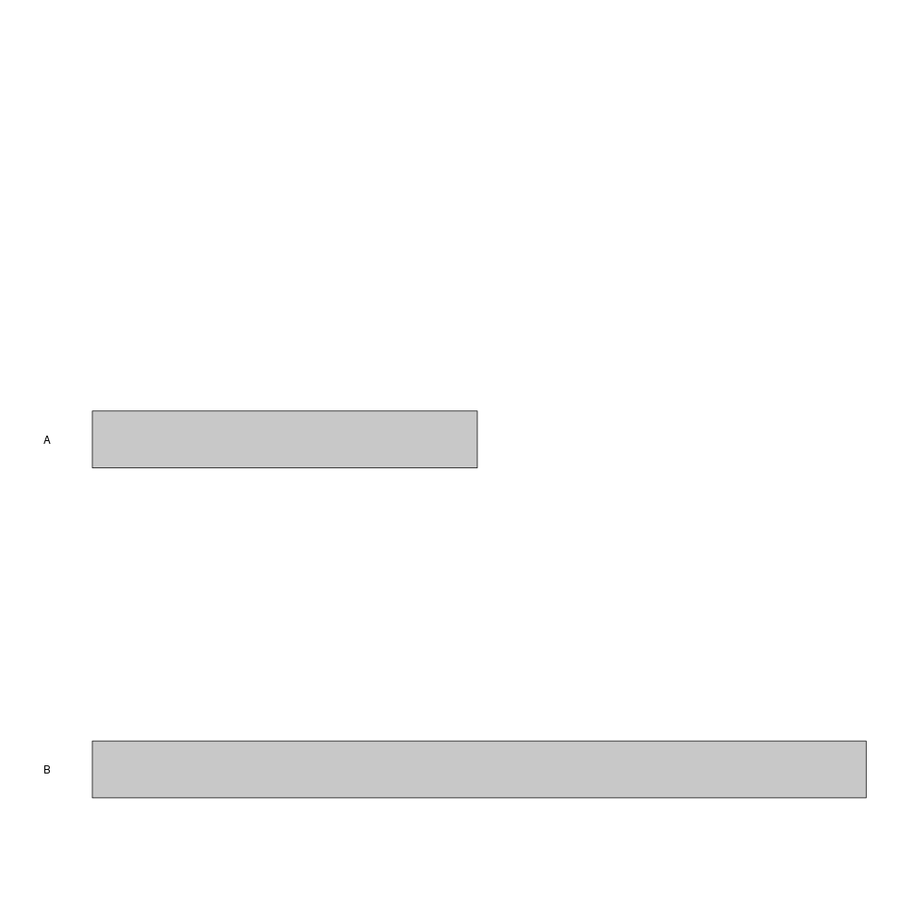
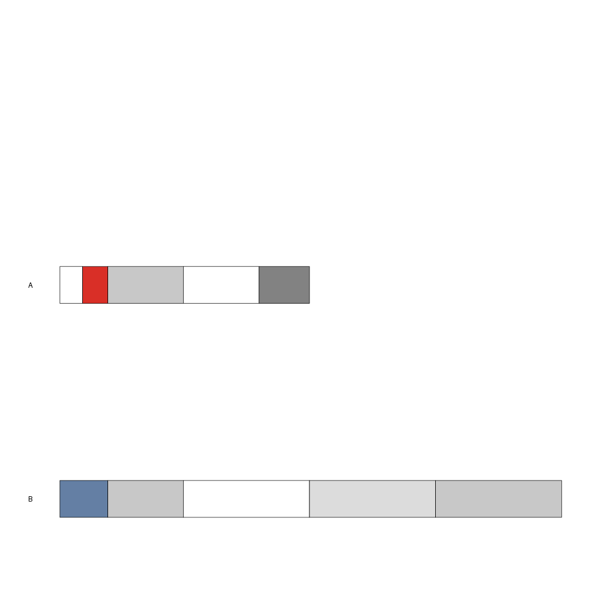

## Plot an ideogram using a custom genomes

In addtion to using prebuilt genomes it is possible to plot ideograms using custom genomes.
The only required information to do that, is a **GRanges** object with one range representing
each chromosome. 

For example, to create an ideogram of a cutom genome with chromosomes *A* 
and *B* of 100 and 200 bases we can do something like


```r
library(karyoploteR)

custom.genome <- toGRanges(data.frame(chr=c("A", "B"), start=c(1, 1), end=c(100, 200)))

kp <- plotKaryotype(genome = custom.genome)
```


or using regioneR's `toGRanges` to read the chromosome from a file, in this case 
[*mygenome.txt*](https://raw.githubusercontent.com/bernatgel/karyoploter_examples/master/Examples/Tutorial/CustomGenomes/mygenome.txt)


```r
library(karyoploteR)

custom.genome <- toGRanges("Tutorial/CustomGenomes/mygenome.txt")

kp <- plotKaryotype(genome = custom.genome)
```



As you can see, however, no cytobands are plotted (since no cytoband information is available)
and the whole chromosomes are plotted in gray. If the cytobands information is available it
can be provided to `plotKaryotype` as a `GRanges` object with two additional columns: 
**name** and **gieStain**. The **gieStain** levels are the ones used at UCSC: *gneg*, 
*gpos25*, *gpos75*, *gpos100*, *gvar*, *acen*, *stalk*, etc. Here, for example, 
we will use the [*mycytobands.txt*](https://raw.githubusercontent.com/bernatgel/karyoploter_examples/master/Examples/Tutorial/CustomGenomes/mycytobands.txt) file.


```r
custom.genome <- toGRanges("Tutorial/CustomGenomes/mygenome.txt")
custom.cytobands <- toGRanges("Tutorial/CustomGenomes/mycytobands.txt")

kp <- plotKaryotype(genome = custom.genome, cytobands = custom.cytobands)
```




