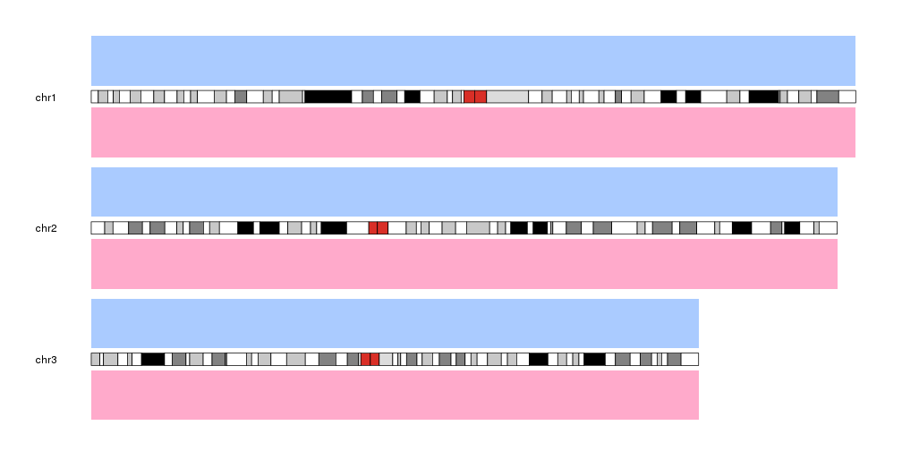
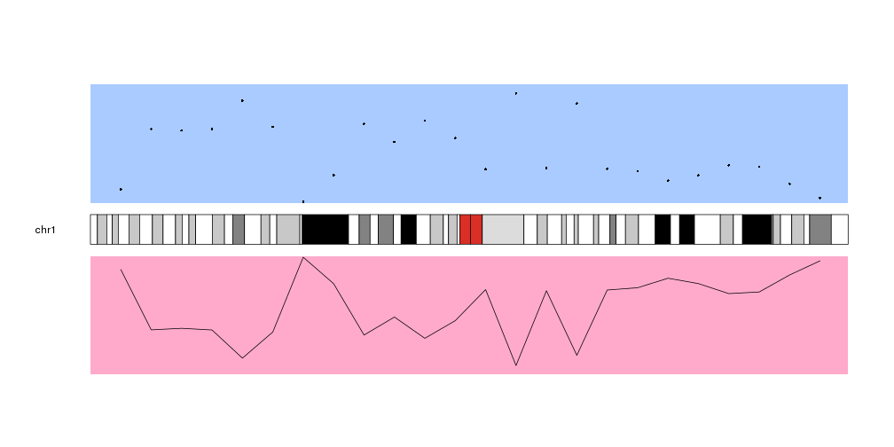
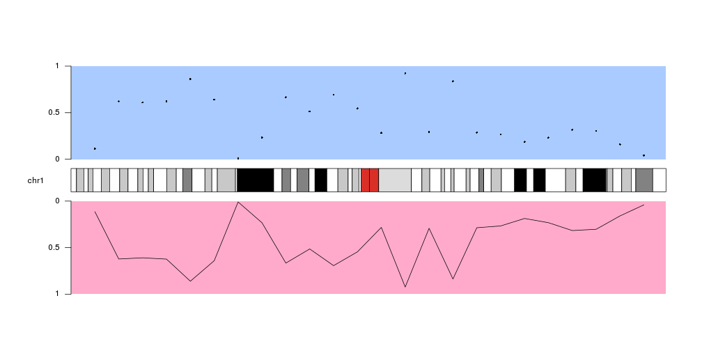
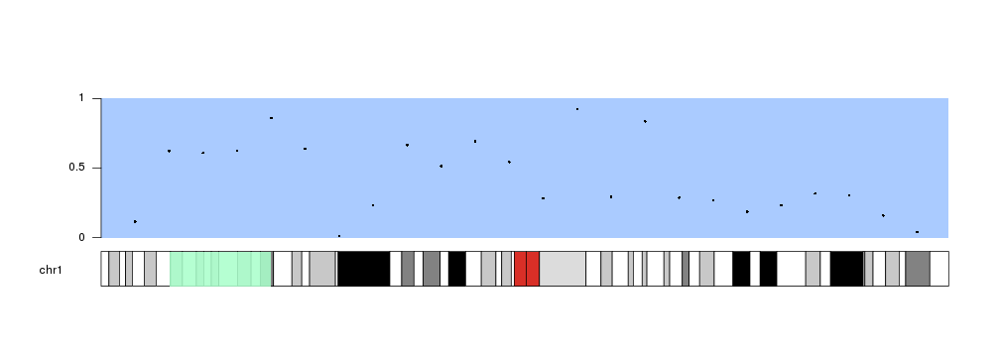
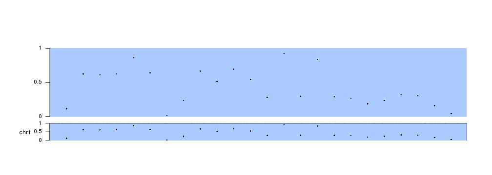
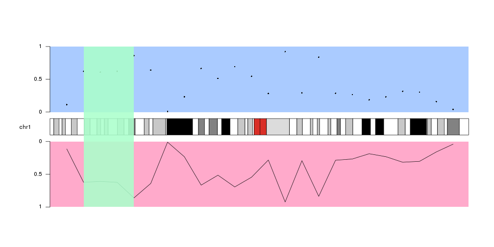

## Data Panels

In karyoploteR, data is plotted in data panels, regions of the plot reserved for
that purpouse. Depending on the plot type, a karyoplot might have one or more 
data panels. It is easy to visualise them using 
`kpDataBackground`. 

## Standard Data Panels

As an example, plot type 2 has two data panels, one above the ideograms and one
below. We can decide on which data panel we want to plot by specifying the
_data.panel_ parameter. For example, we can create a blue(ish) background for data 
panel 1 (above the ideograms) and a red(ish) one for data panel 2 (below the ideograms).


```r
library(karyoploteR)

kp <- plotKaryotype(plot.type=2, chromosomes = c("chr1", "chr2", "chr3"))
kpDataBackground(kp, data.panel = 1, col="#AACBFF")
kpDataBackground(kp, data.panel = 2, col="#FFAACB")
```



Then, to plot data on a given data panel, we use the `data.panel` parameter. 
For example, plot the same data as points above the ideogram (`data.panel=1`) 
and as a line below the ideogram (`data.panel=2`).


```r
x <- 1:24*10e6 #one data point every 10 milion bases (10e6)
y <- runif(n = 24, min = 0, max = 1) #random y values

kp <- plotKaryotype(plot.type=2, chromosomes = "chr1")
kpDataBackground(kp, data.panel = 1, col="#AACBFF")
kpDataBackground(kp, data.panel = 2, col="#FFAACB")
kpPoints(kp, chr="chr1", x=x, y=y, data.panel = 1)
kpLines(kp, chr="chr1", x=x, y=y, data.panel = 2)
```



As you can see, the data in the data panel 2 is inverted with respect to data 
panel 1. This is because both data panels have their base, their lowest level, 
next to the ideogram and "grow" away from it. This can be changed [using the 
`r0` and `r1` parameters]({{ site.baseurl }})
to flip the plotting. 

By default all data panels y axis go from 0 to 1. Plotting an axis using 
[`kpAxis`]({{ site.baseurl }}) can help 
visualize the data panel orientation more easily. These defaults can be changed 
in every plotting function using the 
[data positioning parameters]({{ site.baseurl }})]


```r
kp <- plotKaryotype(plot.type=2, chromosomes = "chr1")
kpDataBackground(kp, data.panel = 1, col="#AACBFF")
kpDataBackground(kp, data.panel = 2, col="#FFAACB")
kpPoints(kp, chr="chr1", x=x, y=y, data.panel = 1)
kpLines(kp, chr="chr1", x=x, y=y, data.panel = 2)
kpAxis(kp, data.panel=1)
kpAxis(kp, data.panel=2)
```




## Special Data Panels

In addition to the standard data panels described above, all  
[plot types]({{ site.baseurl }})
have two special data panels: `"ideogram"` and `"all"`.

These data panels allow plotting in non.standard places, namely, on the ideogram
and over the ideogram and all standard data panels.

### Plotting on the ideogram

To plot on the ideogram we simply need to specify `data.panel="ideogram"` in 
the plotting function call.

For instance, to draw a semitransparent green rectangle in the ideogram we can
simply call `kpRect` like this


```r
kp <- plotKaryotype(plot.type=1, chromosomes = "chr1")
kpDataBackground(kp, data.panel = 1, col="#AACBFF")
kpPoints(kp, chr="chr1", x=x, y=y, data.panel = 1)
kpAxis(kp, data.panel=1)

kpRect(kp, chr="chr1", x0=20e6, x1=50e6, y0=0, y1=1, col="#AAFFCBDD", data.panel="ideogram", border=NA)
```



Instead of kpRect We can use any plotting function in exactly the same way we
would do in a standard data panel


```r
kp <- plotKaryotype(plot.type=1, chromosomes = "chr1")

kpDataBackground(kp, data.panel = 1, col="#AACBFF")
kpPoints(kp, chr="chr1", x=x, y=y, data.panel = 1)
kpAxis(kp, data.panel=1)

kpDataBackground(kp, data.panel = "ideogram", col="#AACBFF")
kpPoints(kp, chr="chr1", x=x, y=y, data.panel = "ideogram")
kpAxis(kp, data.panel="ideogram")
```



### Plotting across all available space

The other special data panel available in all plot types is "all", which
includes all standard data panels and the ideogram.

A typical use case would be to highlight a region of the genome shadowing
the ideogram and the data panels with a colored rectangle, but it can
be used with all plotting functions.


```r
kp <- plotKaryotype(plot.type=2, chromosomes = "chr1")
kpDataBackground(kp, data.panel = 1, col="#AACBFF")
kpDataBackground(kp, data.panel = 2, col="#FFAACB")
kpPoints(kp, chr="chr1", x=x, y=y, data.panel = 1)
kpLines(kp, chr="chr1", x=x, y=y, data.panel = 2)
kpAxis(kp, data.panel=1)
kpAxis(kp, data.panel=2)

kpRect(kp, chr="chr1", x0=20e6, x1=50e6, y0=0, y1=1, col="#AAFFCBDD", data.panel="all", border=NA)
```



