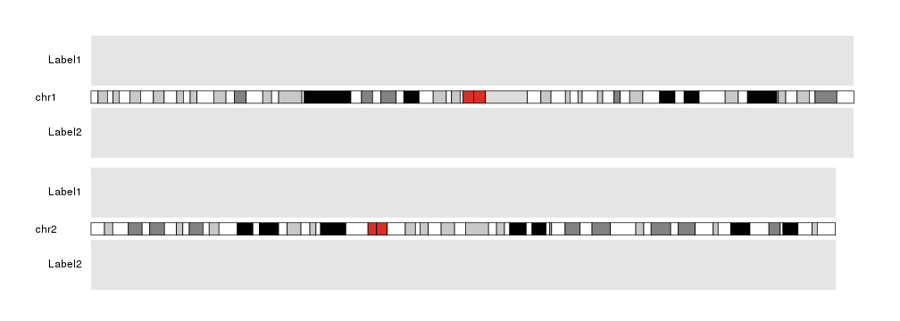
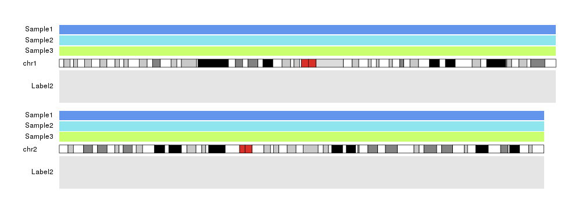
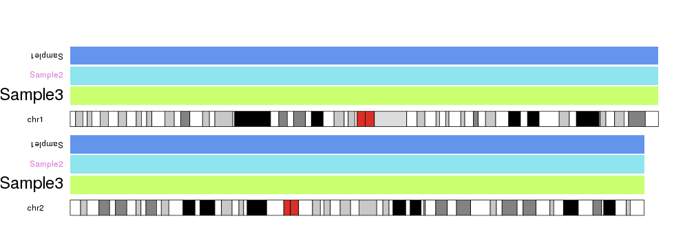

## Labels

Adding labels to complex plots may help the viewer identifying the data plotted.
The function `kpAddLabels` is exactly for that. Labels will appear on the
left side of the plot, in the left margin, next to a 
data panel. The data panel linked to each label is specified using the 
`data.panel` parameter.


```r
kp <- plotKaryotype(plot.type=2, chromosomes=c("chr1", "chr2"))
kpDataBackground(kp)
kpDataBackground(kp, data.panel = 2)
kpAddLabels(kp, labels="Label1", data.panel = 1)
kpAddLabels(kp, labels="Label2", data.panel = 2)
```



In addition to selecting a data panel we can also use 
[r0 and r1]({{ site.baseurl }})
to define the vertical region for a label, so we can actually
label different parts of a data panel, or different tracks.

For example, if we use data panel 1 to plot data on three different samples
we could label them with


```r
kp <- plotKaryotype(plot.type=2, chromosomes=c("chr1", "chr2"))
kpDataBackground(kp, r0=0.66, r1=0.96, color = "cornflowerblue")
kpAddLabels(kp, labels="Sample1", r0=0.66, r1=0.96, data.panel = 1)
kpDataBackground(kp, r0=0.33, r1=0.63, color = "cadetblue2")
kpAddLabels(kp, labels="Sample2", r0=0.33, r1=0.63, data.panel = 1)
kpDataBackground(kp, r0=0, r1=0.30, color = "darkolivegreen1")
kpAddLabels(kp, labels="Sample3", r0=0, r1=0.30, data.panel = 1)
kpDataBackground(kp, data.panel = 2)
kpAddLabels(kp, labels="Label2", data.panel = 2)
```



And we can apply any standard graphical parameter to the labels to tweak their 
appearance


```r
kp <- plotKaryotype(plot.type=1, chromosomes=c("chr1", "chr2"))
kpDataBackground(kp, r0=0.66, r1=0.96, color = "cornflowerblue")
kpAddLabels(kp, labels="Sample1", r0=0.66, r1=0.96, data.panel = 1, srt=180, pos=4)
kpDataBackground(kp, r0=0.33, r1=0.63, color = "cadetblue2")
kpAddLabels(kp, labels="Sample2", r0=0.33, r1=0.63, data.panel = 1, col="orchid")
kpDataBackground(kp, r0=0, r1=0.30, color = "darkolivegreen1")
kpAddLabels(kp, labels="Sample3", r0=0, r1=0.30, data.panel = 1, cex=2)
```




