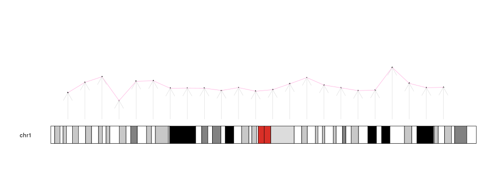
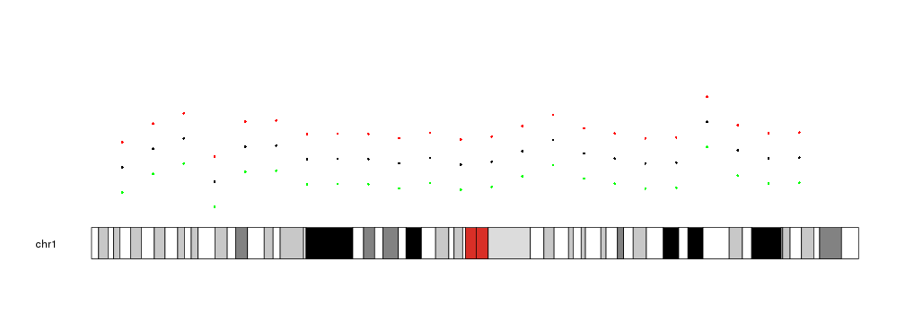

## Low-level plotting functions

Plotting functions in karyoploteR are divided in two groups: low- and high-level.
Low level plotting functions are mainly chromosome-aware versions of the R base
graphics primitives: points, lines, segments, polygons... and they do not compute
anything and know nothing about biology or complex bioconductor objects.

They all share the same naming scheme: _kpPrimitive_, that means, _kpPoints_ to 
plot points, _kpLines_ to plot lines, _kpArrows_ for arrows, etc. All of them
are customizable using the standrad R base [graphical parameters](https://www.rdocumentation.org/packages/graphics/versions/3.4.0/topics/par)
and all of them share almost the same API.

To use them, we first need to create a karyoplot with a call to _plotKaryotype_.
After that, successive calls to the plotting functions will add new graphical 
elements to the plot.


```r
library(karyoploteR)

x <- 1:23*10e6
y <- rnorm(23, 0.5, 0.1)

kp <- plotKaryotype(chromosomes="chr1")

kpPoints(kp, chr = "chr1", x=x, y=y)
kpText(kp, chr="chr1", x=x, y=y, labels=c(1:23), pos=3)
kpLines(kp, chr="chr1", x=x, y=y, col="#FFAADD")

kpArrows(kp, chr="chr1", x0=x, x1=x, y0=0, y1=y, col="#DDDDDD")
```


## Common parameters

The low-level plotting functions can, again, be classified in two groups: those 
that need a single point specified by x and y (such as points, lines, text...) 
and those that need pair of points (x0, x1, y0, y1): segments, arrows, bars,
polygons, etc. Some of the functions have special parameters, such as _labels_
in _kpText_. In addition, all functions need a _chr_ parameter to fully specify
the position of each data point and the _karyoplot_ object returned by _plotKaryotype_
as the first parameter. 

In addition to that, all functions accept a standard set of parameters to 
further modify the data positioning. These parameters are explained in the next section.

## The _data_ parameter

There is a special convenience parameter called _data_. With it, it's possible 
to use a GRanges object to provide in a single object the needed data to the 
plotting functions. _x_, _x0_ and _x1_ will be derived from the start and end
of the ranges in data, _y_, _y0_ and _y1_ from the _mcols_ annotation, as well
_labels_ and other specific parameters. If any of this parameters is explicitly 
passed, it will be used instead of the one from data.

For example, we can create a GRanges object with the data used in the previous plot


```r
mydata <- toGRanges(data.frame(chr=rep("chr1", 23), start=x, end=x, y=y))
head(mydata)
```

```
## GRanges object with 6 ranges and 1 metadata column:
##       seqnames               ranges strand |                 y
##          <Rle>            <IRanges>  <Rle> |         <numeric>
##   [1]     chr1 [10000000, 10000000]      * | 0.379293425061458
##   [2]     chr1 [20000000, 20000000]      * | 0.527742924211066
##   [3]     chr1 [30000000, 30000000]      * | 0.608444117668306
##   [4]     chr1 [40000000, 40000000]      * | 0.265430229737065
##   [5]     chr1 [50000000, 50000000]      * | 0.542912468881105
##   [6]     chr1 [60000000, 60000000]      * | 0.550605589215757
##   -------
##   seqinfo: 1 sequence from an unspecified genome; no seqlengths
```

And create the same plot using this object, except for the arrows where we have 
to specify the _y0_ and _y1_ values since the columns in _data_ need to have the
same names as the parameters they stand for.


```r
kp <- plotKaryotype(chromosomes="chr1")

kpPoints(kp, data=mydata)
kpText(kp, data=mydata, pos=3)
kpLines(kp, data=mydata, col="#FFAADD")

kpArrows(kp, data=mydata, y0=0, y1=y, col="#DDDDDD")
```



And in all cases, if _y_, _y0_ or _y1_ are explicitly stated, they will take 
precedence before the values derived from _data_


```r
kp <- plotKaryotype(chromosomes="chr1")

kpPoints(kp, data=mydata)
kpPoints(kp, data=mydata, y=y+0.2, col="red")
kpPoints(kp, data=mydata, y=y-0.2, col="green")
```




