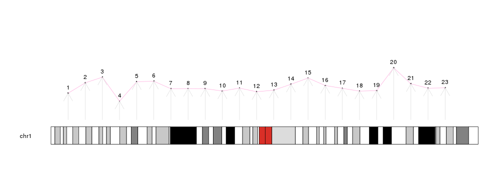

## Low-level plotting functions

Plotting functions in karyoploteR are divided in two groups: low- and high-level.
Low level plotting functions are mainly chromosome-aware versions of the R base
graphics primitives: points, lines, segments, polygons...

They all share the same naming scheme: _kpPrimitive_, that means, _kpPoints_ to 
plot points, _kpLines_ to plot lines, _kpArrows_ for arrows, etc. All of them
are customizable using the standrad R base [graphical parameters](https://www.rdocumentation.org/packages/graphics/versions/3.4.0/topics/par)
and all of them share almost the same API.

To use them, we first need to create a karyoplot with a call to _plotKaryotype_.
After that, successive calls to the plotting functions will add new graphical 
elements to the plot.


```r
library(karyoploteR)

x <- 1:23*10e6
y <- rnorm(23, 0.5, 0.1)

kp <- plotKaryotype(chromosomes="chr1")

kpPoints(kp, chr = "chr1", x=x, y=y)
kpText(kp, chr="chr1", x=x, y=y, labels=c(1:23), pos=3)
kpLines(kp, chr="chr1", x=x, y=y, col="#FFAADD")

kpArrows(kp, chr="chr1", x0=x, x1=x, y0=0, y1=y, col="#DDDDDD")
```



## Common parameters

The low-level plotting functions can, again, be classified in two groups: those 
that need a single point specified by x and y (such as points, lines, text...) 
and those that need pair of points (x0, x1, y0, y1): segments, arrows, bars,
polygons, etc. Some of the functions have special parameters, such as _labels_
in _kpText_. In addition, all functions need a _chr_ parameter to fully specify
the position of each data point and the _karyoplot_ object returned by _plotKaryotype_
as the first parameter. 

In addition to that, all functions accept a standard set of parameters to 
further modify the data positioning. These parameters are explained in the next section.
