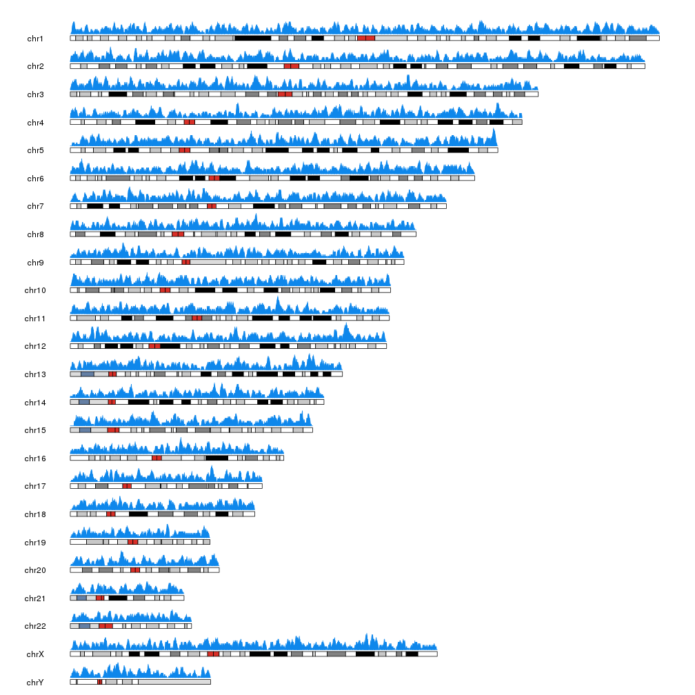
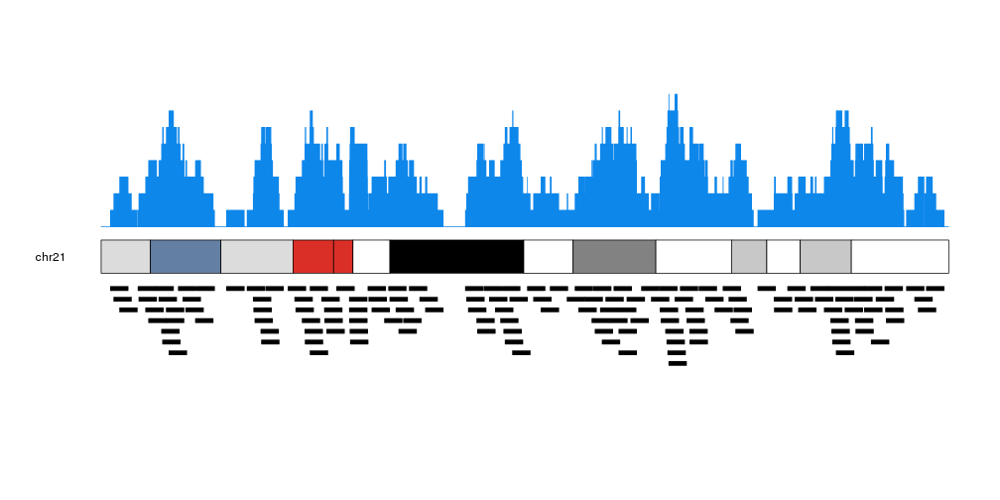
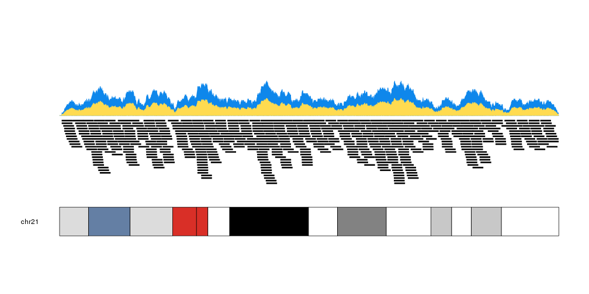

## Plotting the per base coverage of genomic features

The **kpPlotCoverage** function is similar to 
[kpPlotDensity]({{ site.baseurl }})
but instead of plotting the number of features overalpping a certain genomic window,
it plots the actual number of features overlapping every single base of the genome.
Conceptually, it is equivalent to `kpPlotDensity` with _window.size_ set to 1 but
much faster, since internally it uses the `coverage` method from 
[GenomicRanges](https://bioconductor.org/packages/GenomicRanges).


```r
library(karyoploteR)
regions <- createRandomRegions(nregions=10000, length.mean = 1e6, mask=NA)
kp <- plotKaryotype()
kpPlotCoverage(kp, data=regions)
```



The actual representation of the data is also different than that of 
`kpPlotDensity`: **kpPlotCoverage** uses **kpBars** to create the plot, giving 
it a histogram-like appearance.

We can plot the actual regions in data panel 2 to see how they relate


```r
kp <- plotKaryotype(plot.type=2, chromosomes = "chr21")
kpPlotCoverage(kp, data=regions)
kpPlotRegions(kp, data=regions, data.panel=2)
```



It is possible to customize the appearance of the coverage plot using the same 
parameters used for 
[kpRect]({{ site.baseurl }}).


```r
more.regions <- createRandomRegions(nregions=40000, length.mean = 1e6, mask=NA)
kp <- plotKaryotype(plot.type=1, chromosomes = "chr21")
kpPlotCoverage(kp, data=more.regions, r0=0.7, r1=1, col="#0e87eb")
kpPlotCoverage(kp, data=more.regions, r0=0.7, r1=0.85, col="#ffdb50")
kpPlotRegions(kp, data=more.regions, r0=0.65, r1=0)
```



