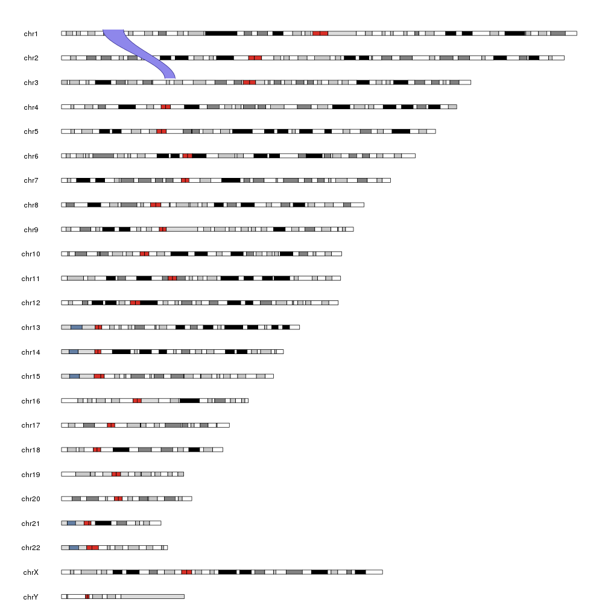
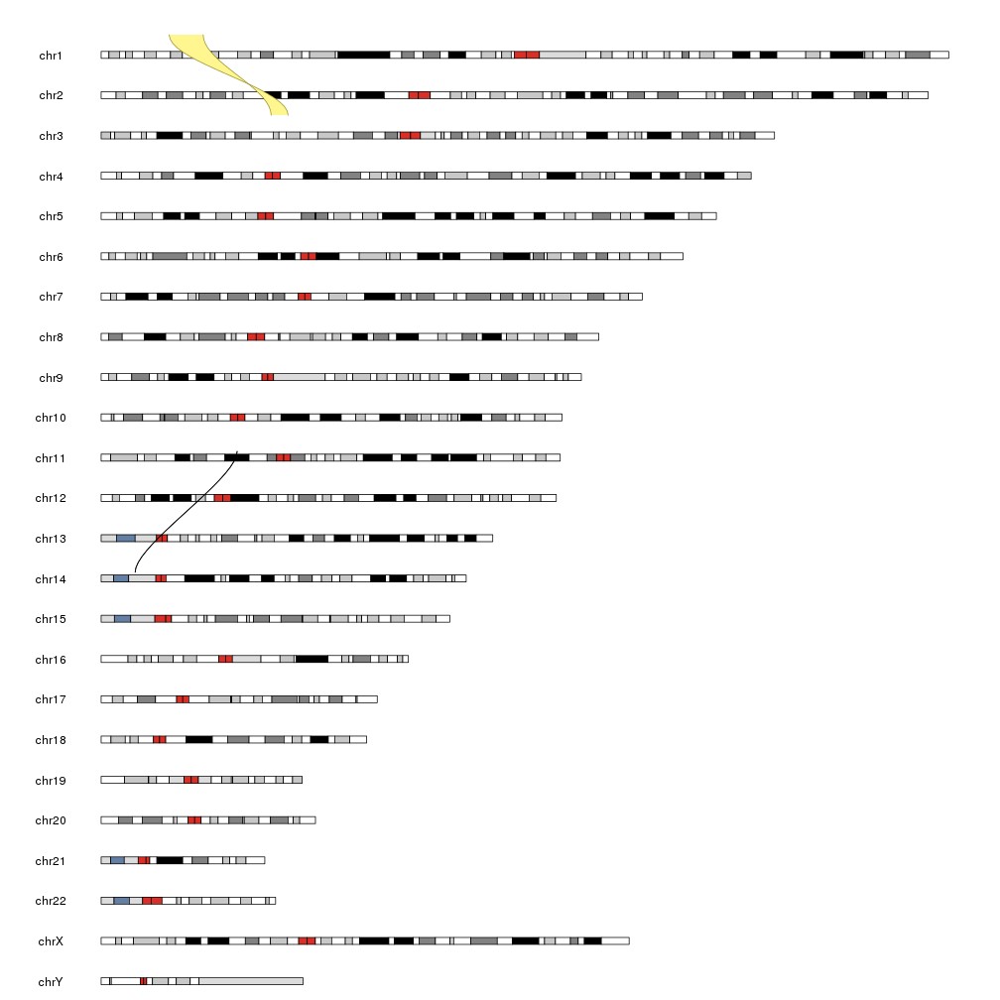
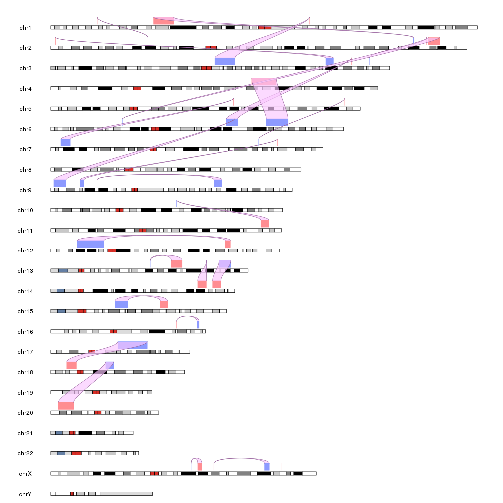

## Plotting links between genomic regions

The **kpPlotLinks** function plots lines between pairs of genomic regios.
It is useful to depict translocations and other genomic rearrangements. Links
are plotted as curved bezier lines between the start (end) of a region and 
the start (end) of its pair with the space bewteen them optionally filled.
The strand of the region is taken into account and therefore it is possible
to represent inversions. 

The easiest way of specifying the regions to plot is with 2 _GRanges_ objects:
one for the starts of the links and the other for the ends.


```r
library(karyoploteR)
start.regs <- toGRanges(data.frame("chr1", 20e6, 30e6))
end.regs <- toGRanges(data.frame("chr3", 50e6, 55e6))

kp <- plotKaryotype()
kpPlotLinks(kp, data=start.regs, data2=end.regs)
```



And we can flip one of the regions by setting it to the negative strand.


```r
strand(end.regs)[1] <- "-"

kp <- plotKaryotype()
kpPlotLinks(kp, data=start.regs, data2=end.regs)
```


We can use `col` and `border` to change the appearance of the link, including
setting them to NA to not be plotted and we can create sigle line links with 
small-enought regions. We can also change the vertical position of the links 
start and end with the _y_ parameter (and the standard _r0_, _r1_, etc...).


```r
start.regs.small <- toGRanges(data.frame("chr14",10e6, 10e6))
end.regs.small <- toGRanges(data.frame("chr11", 40e6, 40e6))

kp <- plotKaryotype()
kpPlotLinks(kp, data=start.regs, data2=end.regs, col="#FFF68F", y=0.5)
kpPlotLinks(kp, data=start.regs.small, data2=end.regs.small, col="black")
```



And we can plot multiple links creating a larger GRanges object. The only 
restriction is that _data_ and _data2_ must be of equal length, since the n-th 
region in _data_ will be linked to the n-th region in _data2_.

For example we can create a bunch of random regions and link them.


```r
starts <- sort(createRandomRegions(nregions = 25, length.sd = 8e6))
ends <- sort(createRandomRegions(nregions = 25, length.sd = 8e6))

kp <- plotKaryotype()
kpPlotRegions(kp, starts, r0=0, r1=0.5, col="#ff8d92")
kpPlotRegions(kp, ends, r0=0, r1=0.5, col="#8d9aff")
kpPlotLinks(kp, data=starts, data2=ends, col="#fac7ffaa", r0=0.5)
```


