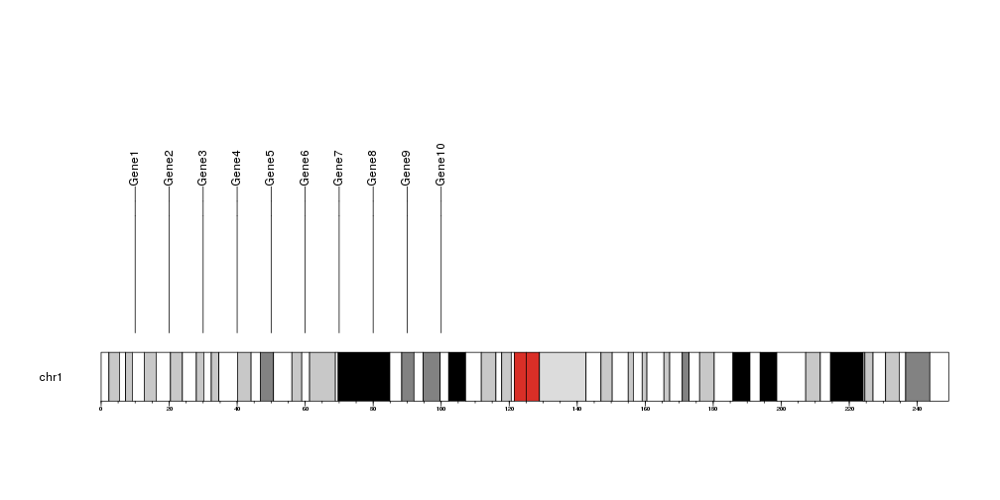
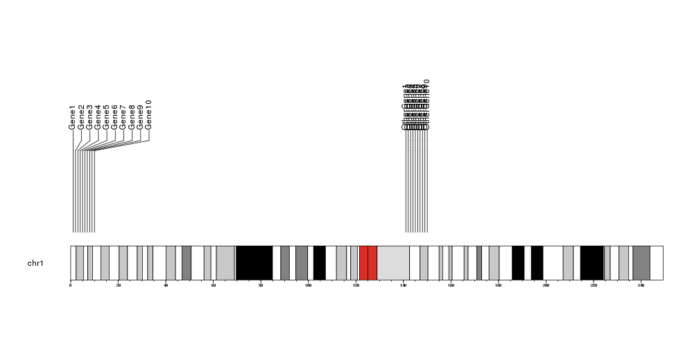
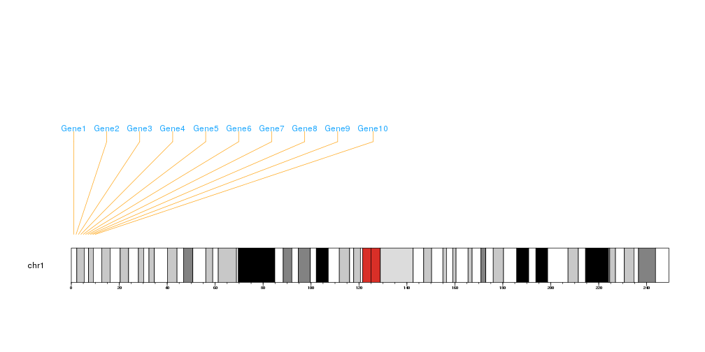

## Plotting Genomic Markers

The function **kpPlotMarkers** can be used to plot markers along the genome,
that is, specific positions of the genome with a name: genes, snps, etc...

We will create a set of example markers and plot them on the genome


```r
library(karyoploteR)

markers <- data.frame(chr=rep("chr1", 10), pos=(1:10*10e6), labels=paste0("Gene", 1:10))

kp <- plotKaryotype(chromosomes="chr1")
kpAddBaseNumbers(kp)
kpPlotMarkers(kp, chr=markers$chr, x=markers$pos, labels=markers$labels)
```



If the positions are closer and the labels will overlap, they will be moved to
avoid the overlapping as much as possible. If the label movement is not desired,
it can be disabled setting **adjust.label.position=FALSE** .


```r
markers <- data.frame(chr=rep("chr1", 10), pos=(1:10*1e6), labels=paste0("Gene", 1:10))

kp <- plotKaryotype(chromosomes="chr1")
kpAddBaseNumbers(kp)
kpPlotMarkers(kp, chr=markers$chr, x=markers$pos, labels=markers$labels)


markers2 <- data.frame(chr=rep("chr1", 10), pos=140e6+(1:10*1e6), labels=paste0("OtherGene", 1:10))

kpPlotMarkers(kp, chr=markers2$chr, x=markers2$pos, labels=markers2$labels, adjust.label.position=FALSE)
```



The markers information can be passed as a set of parameters (chr, x, labels) or
as a GenomicRanges object with a *labels* column.

It is possible to customize the marker plotting in several ways. It is possible
to specify a different color for the line and the label, to split the line 
bending in different proportions, to adjust the text orientation and margins and
in general to use most of the standard graphics parameters.


```r
markers <- data.frame(chr=rep("chr1", 10), pos=(1:10*1e6), labels=paste0("Gene", 1:10))

kp <- plotKaryotype(chromosomes="chr1")
kpAddBaseNumbers(kp)
kpPlotMarkers(kp, chr=markers$chr, x=markers$pos, labels=markers$labels,
              text.orientation = "horizontal", marker.parts = c(0, 0.9, 0.1),
              line.color = "#FFAA22", label.color = "#22AAFF", 
              label.dist = 0.01, max.iter = 1000)
```



