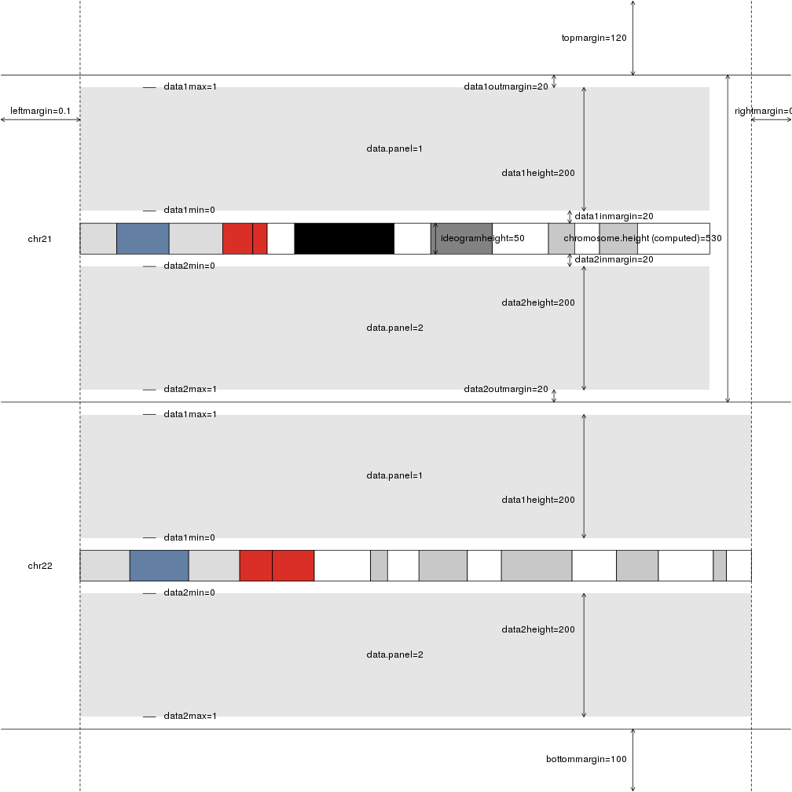
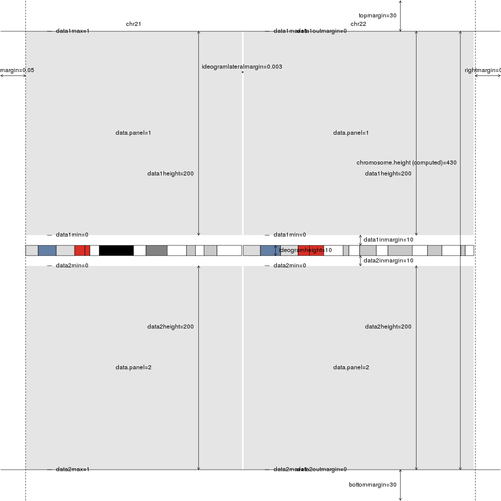
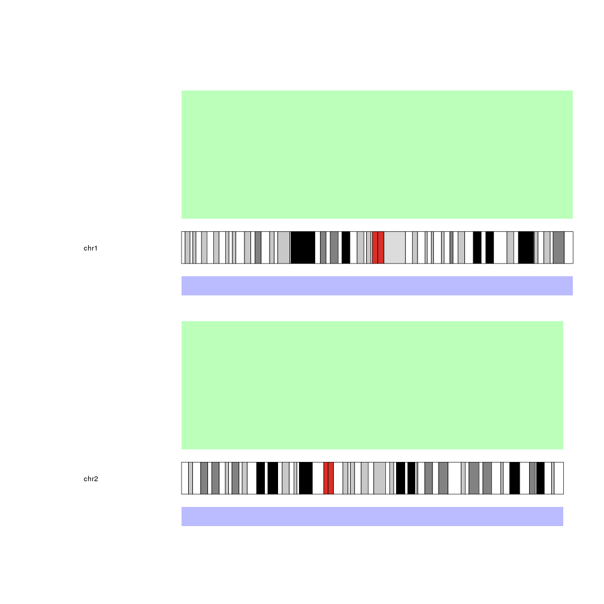
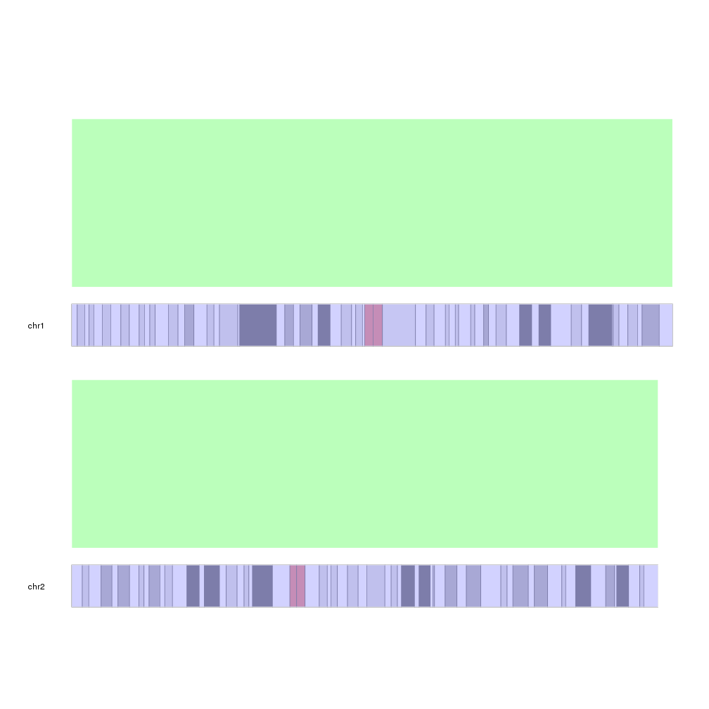

## Adjusting plotting parameters

Once we have selected a 
[plot.type]({{ site.baseurl }}
with its chromosome organization and its 
[data panels]({{ site.baseurl }}, 
we can further customize the general plot apperance using plotting parameters.
Plotting parameters define the relative sizing of the different elements, their
margins and positions.

### What plotting parameters are available?

The easiest way to see the avialable plotting parameters and their default
values for a given plot type is to use a utility function that plots the default
plot params, aptly named `plotDefaultPlotParams()`. It will create a karyoplot
with 2 chromosomes using the given plot type and draw all the available plotting
parameters and their default values on them.


```r
library(karyoploteR)
plotDefaultPlotParams(plot.type=2)
```



In addition to the margins and sizes, includes the names of the available data
panels as well as their default minimum and maximum values. 

Giving it a different plot type will produce the plot adapted to it with
the different default values.


```r
plotDefaultPlotParams(plot.type=3)
```




### How can I change the plotting parameters?

Plotting parameters have to be passed to `plotKaryotype` using the _plot.params_
parameter. Since plotting parameters have to be a list with values for all 
plotting parameters, the recommended way of changing them is getting the
object with the default values using `getDefaultPlotParams()`, modify the
desired values and passing the modified object to `plotKaryotype`.

For example, to create a big margin on the left-hand side and reduce the size of 
the second data panel, we can use: 


```r
pp <- getDefaultPlotParams(plot.type=2)
pp$leftmargin <- 0.3
pp$data2height <- 30
kp <- plotKaryotype(chromosomes=c("chr1", "chr2"), plot.type=2, plot.params = pp)
kpDataBackground(kp, data.panel = 1, color = "#BBFFBB")
kpDataBackground(kp, data.panel = 2, color = "#BBBBFF")
```



Or we can even hackishly use a negative margin to move the data panel 2 into 
the ideogram to plot over the ideogram itself. A new plot type with a panel on 
the ideogram is expected to be introduced soon to get this feature without
dubious tricks.


```r
pp <- getDefaultPlotParams(plot.type=2)
pp$data2height <- pp$ideogramheight
pp$data2inmargin <- -1 * pp$ideogramheight
kp <- plotKaryotype(chromosomes=c("chr1", "chr2"), plot.type=2, plot.params = pp)
kpDataBackground(kp, data.panel = 1, color = "#BBFFBB")
kpDataBackground(kp, data.panel = 2, color = "#BBBBFFAA")
```


