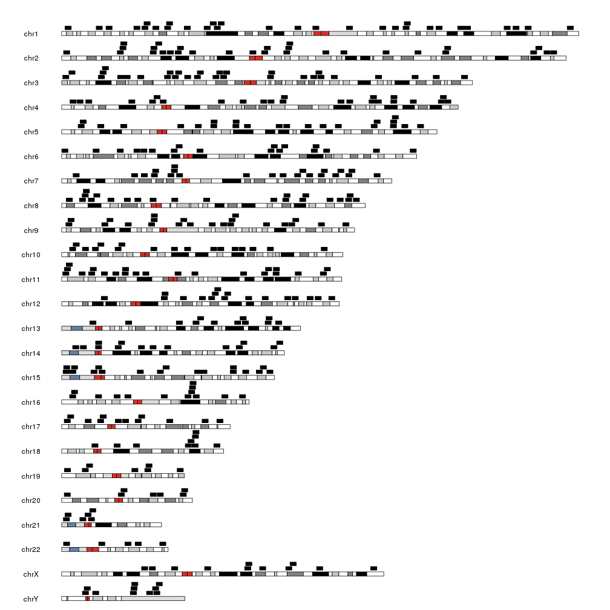
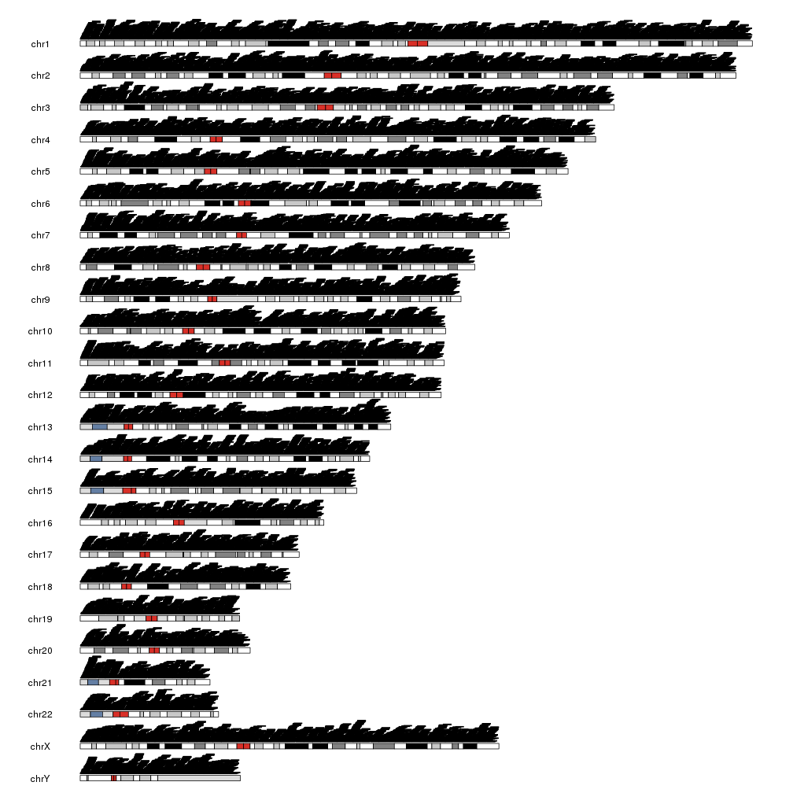
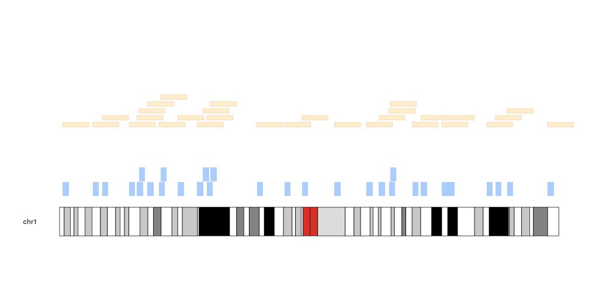
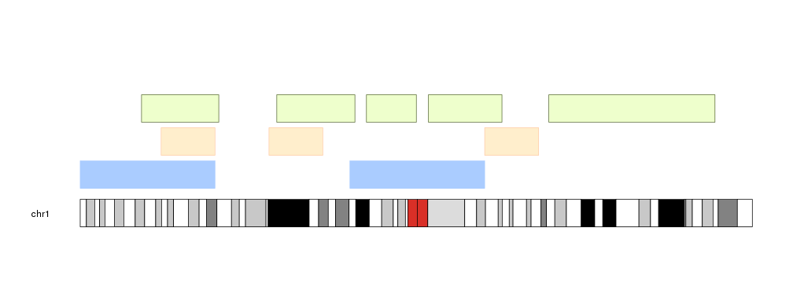

## Plotting Genomic Regions

The function **kpPlotRegions** as its name suggest, can be used to plot regions
along the genome. Regions are plotted as rectangles and the function includes 
an option (active by default) to plot overlapping regions as a stack. This
function only accepts regions as _GRanges_ objects and does not accept
the _chr_, _x0_, _x1_, _y0_ and _y2_ parameters used by `kpRect`.

We will create a set of random regions using 
[regioneR's](https://bioconductor.org/packages/regioneR/) 
`createRandomRegions` function and plot them on the genome.


```r
library(karyoploteR)
regions <- createRandomRegions(nregions=400, length.mean = 3e6, mask=NA, non.overlapping = FALSE)
kp <- plotKaryotype()
kpPlotRegions(kp, data=regions)
```



The height of the rectangles is adjusted so the tallest pile of regions fits in
the data panel, making the regions flatter if needed. For example, plotting 40K 
regions produces a plot like this. 


```r
many.regions <- createRandomRegions(nregions=40000, length.mean = 3e6, mask=NA, non.overlapping = FALSE)
kp <- plotKaryotype()
kpPlotRegions(kp, data=many.regions)
```



It is possible to customize the appearance of the regions using the same 
parameters used for
[kpRect]({{ site.baseurl }}) plus the
additional parameters _avoid.overlapping_, _num.layers_ and _layer.margin_ to 
control the layering of the regions.


```r
kp <- plotKaryotype(chromosomes="chr1")
kpPlotRegions(kp, data=regions, col="#AACCFF", layer.margin = 0.01, border=NA, r0=0, r1=0.5)
kpPlotRegions(kp, data=extendRegions(regions, extend.end = 10e6), col="#FFEECC", layer.margin = 0.05, border="#FFCCAA", r0=0.6, r1=1)
```




# Input Regions

As in most functions in karyoploteR, `kpPlotRegions` uses internally the 
`toGRanges`function from 
[regioneR](https://bioconductor.org/packages/regioneR/). This means that it's
possible to call `kpPlotRegions` with a bed-like file, even a remote one,
a data.frame or even an array of characters defining the regions. You can find
more information on the valid formats in 
[regioneR's vignette](http://bioconductor.org/packages/release/bioc/vignettes/regioneR/inst/doc/regioneR.html#region-sets).


```r
kp <- plotKaryotype(chromosomes="chr1")
kpPlotRegions(kp, data=c("chr1:1-50000000", "chr1:100e6-150e6"), col="#AACCFF", r0=0, r1=0.25)
df <- data.frame(chr=c("chr1", "chr1", "chr1"), start=c(30e6, 70e6, 150e6), end=c(50e6, 90e6, 170e6))
kpPlotRegions(kp, data=df, col="#FFEECC", border="#FFCCAA", r0=0.3, r1=0.55)
kpPlotRegions(kp, data="Tutorial/PlotRegions/regions.txt", col="#EEFFCC", border=darker("#EEFFCC"), r0=0.6, r1=0.85)
```




