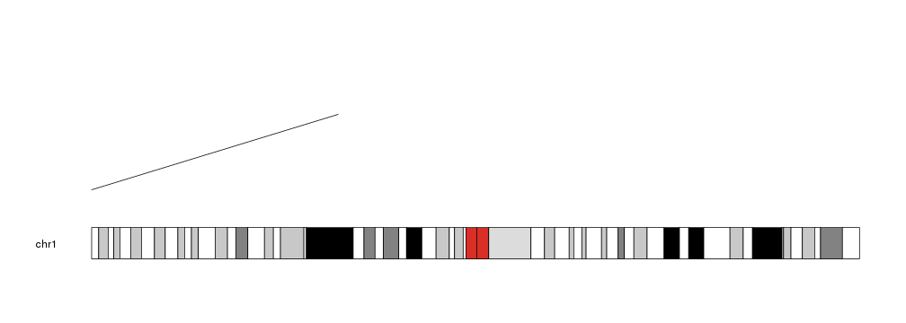
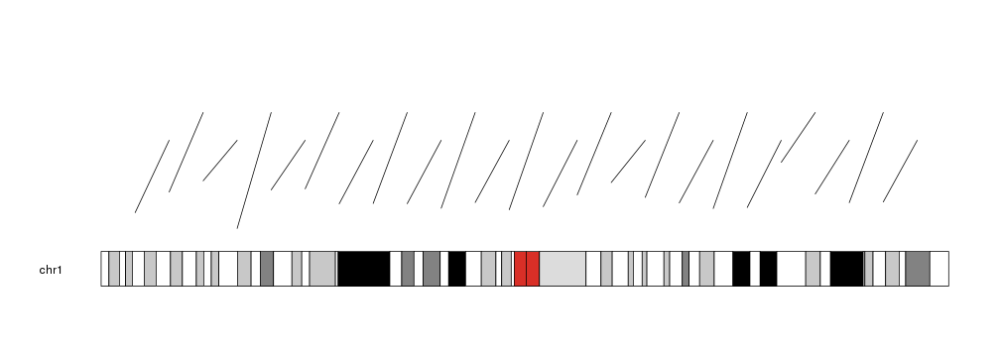
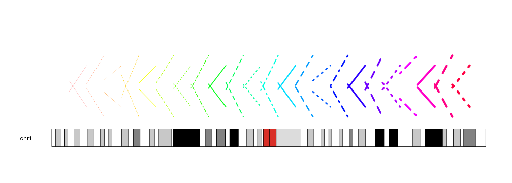

## Plotting Segments

To plot segments in a karyoplot we need to use the `kpSegments` function. Given a
character vector _chr_ and 4 integer vectors _x0_, _y0_, _x1_ and _y1_ it 
will plot segments going from (_x0_, _y0_) to (_x1_, _y1_).


```r
library(karyoploteR)

kp <- plotKaryotype(chromosomes="chr1")
kpSegments(kp, chr="chr1", x0=0, x1=80e6, y0=0.2, y1=0.8)
```



We can give it vectors of positions and it will plot a segment for each element 
in the vectors (recycling them if necessary).


```r
library(karyoploteR)

x0 <- 1:23*10e6
x1 <- 2:24*10e6
y0 <- rnorm(23, mean=0.3, sd=0.1)
y1 <- c(0.7, 0.9)

kp <- plotKaryotype(chromosomes="chr1")
kpSegments(kp, chr="chr1", x0=x0, x1=x1, y0=y0, y1=y1)
```



The lines can be customized with the same 
[graphical parameters](https://www.rdocumentation.org/packages/graphics/topics/par)
as in the R base graphics `segments` function: _lwd_, _lty_, _col_...


```r
kp <- plotKaryotype(chromosomes="chr1")
kpSegments(kp, chr="chr1", x0=x0, x1=x1, y0=y0, y1=y1, col=rainbow(23), 
           lty=c(1,2,3,4), lwd=(1:23)/4, r0=0.3, r1=1)
kpSegments(kp, chr="chr1", x0=x0, x1=x1, y0=y0, y1=y1, col=rainbow(23), 
           lty=c(1,2,3,4), lwd=(1:23)/4, r0=0.7, r1=0)
```




